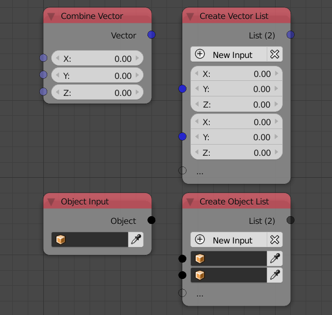
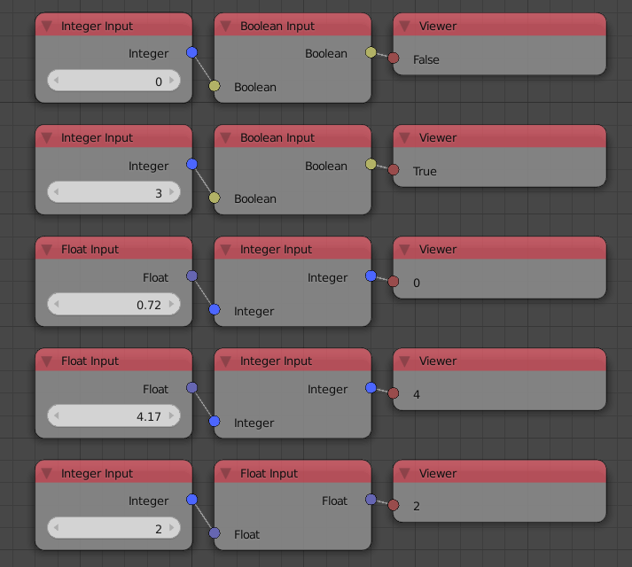
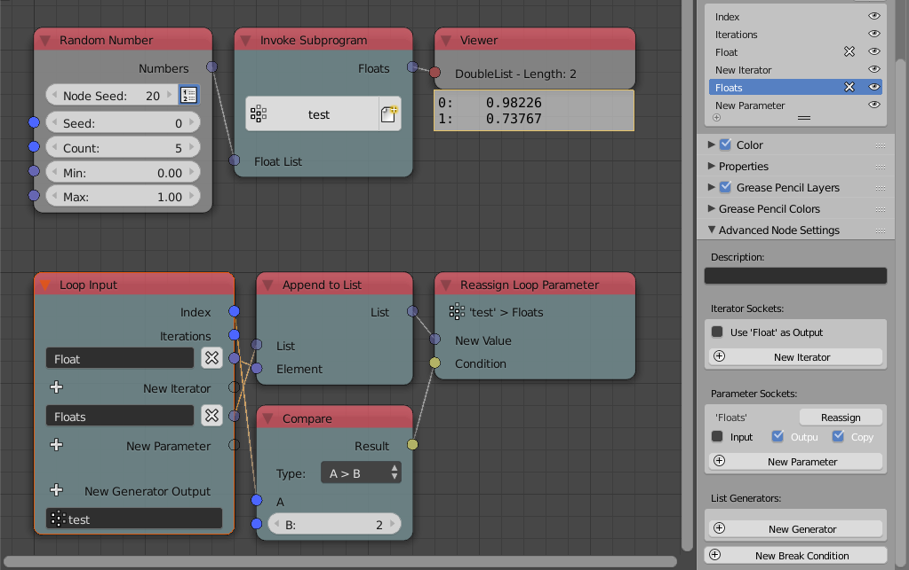
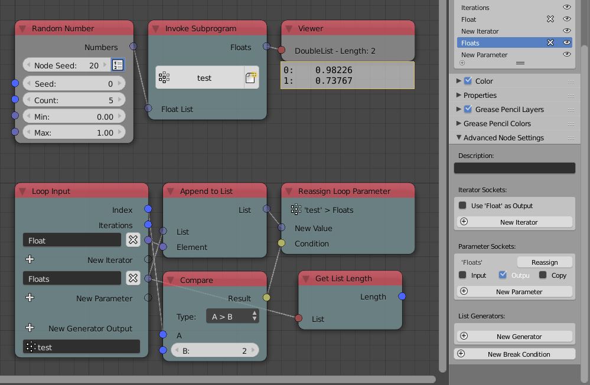
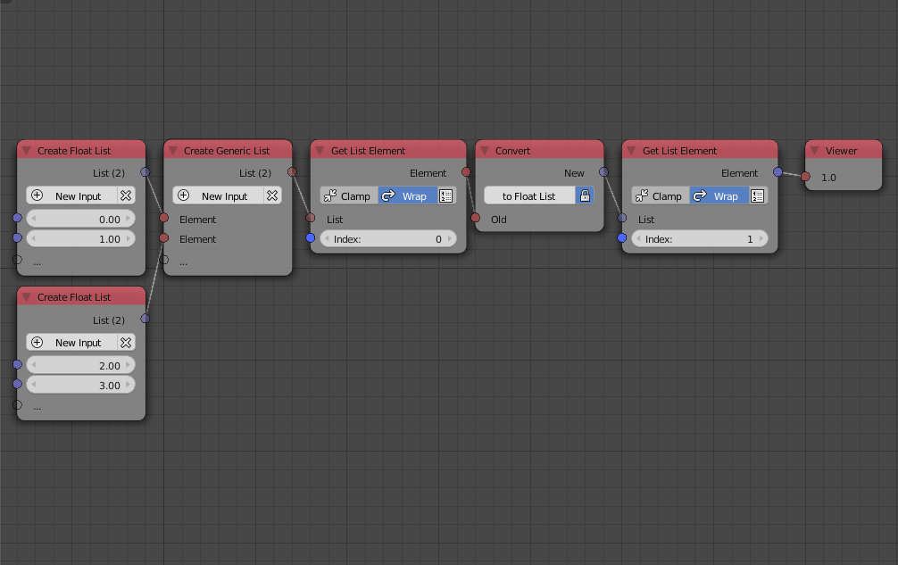
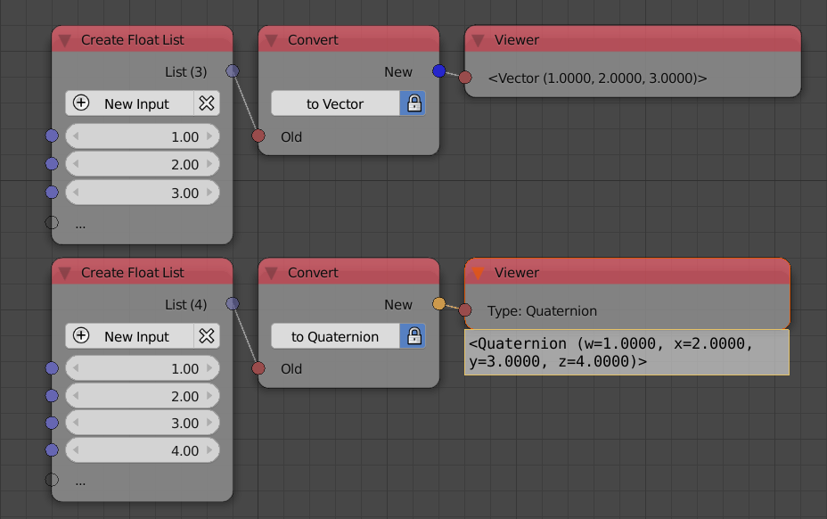
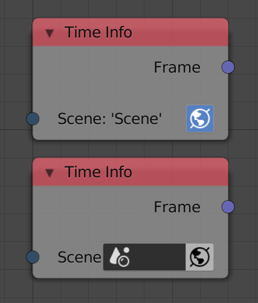

Data in Animation Nodes is typed, that is, sockets have specific data
types which can be identified by their color. For instance, a blue
socket represents a *3D Vector* data type and a black socket represents
an *Object* data type. If one attempts to connect two node sockets,
unless they have the same data type or the origin type can be implicitly
converted to the target type, Animation Nodes won't allow the
connection.

All data types have corresponding list types, list data types have the
same socket color but are somewhat transparent. For instance, the 3D
Vector data type has a corresponding 3D Vector List that can exclusively
store 3D Vectors.

The output of the *Combine Vector* and *Object Input* nodes are 3D
Vector and Object respectively, the output of the *Create Vector List*
and *Create Object List* are 3D Vector List and Object List
respectively, notice that lists sockets have the same color but are
transparent.

## Implicit Conversion

Some data types can be *implicitly* converted to other data types, the
conversion happens at the socket level. Thus, it is noted that some
sockets accept more than one data type. For instance, it is possible to
connect Integers, Floats and Booleans together because all of which are
numbers and can be implicitly converted to each other.

{}

A boolean when converted to a number is `1` if `True` and `0` if
`False`. Moreover, a number when converted to boolean is `True` if it is
non zero and `False` if zero. Floats are floored when converted into
integers, so `1.5` becomes `1` and `2.7` becomes `2`.

{}

As of `v2.0`, the only implicit conversions are between integers, floats
and booleans and their lists.

## Dynamic Sockets

Dynamic sockets are sockets that can change their type dynamically and
automatically whenever needed. For instance, the *Get List Element* node
takes a list and returns one of its elements, the input list socket
changes its type to the type of the list you input and the output socket
changes its type to the type of the elements of the the list you input.



{}

Most nodes that have dynamic sockets allows manual type change through
an operator in the *Advanced Node Settings*.

{}

## Vectorized Sockets

Some nodes in Animation Nodes are said to be "vectorized". Vectorization
is the ability of the node to operate on lists just as it can operate on
individual elements.

A vectorized node has vectorized sockets, such sockets change from list
types to their element type and vise versa based on your input. For
instance, the *Parse Number* node parses the input text, if I were to
input a text list the input socket will automatically turn into a text
list. A vectorized socket have the same color as its data type but is
semi-transparent.



{}

Vectorized sockets can not be converted manually, contrary to Dynamic
Sockets.

{}

## Data Copying

Data types in Animation Nodes are either *mutable* or *immutable*,
mutable means the data type can be edited/mutated and immutable means it
can not. For instance, lists are mutable, but integers and floats are
not. To understand the difference, we shall look at two nodes, the *Add*
node and the *Remove List Element* node, which process immutable and
mutable data types respectively.

- The *Add* node takes an input number, read its value, add that value
    to another value, and return the result of addition. The value of
    the input was not altered/mutated in anyway, the node only read its
    value, and the output is a new different value containing the result
    of addition.
- The *Remove List Element* node takes an input list, removes an
    element from it, and return the list. The output list is the same
    list that was input, only it was mutated/altered by removing an
    element from it.

Mutable objects introduces certain complications, for instance, if one
added two *Remove List Element* nodes, one of which removes the first
element and the other removes the last element, upon viewing the result
of both nodes, we find that both output lists have their first and last
elements removed, what happened here? Since the input list is mutable,
one node edited the list by removing the first element and the other
edited the same list by removing the last element, when one view both
output lists, one is actually viewing the same list that was edited,
hence the result. But if one wants two versions of the list, one with
only the first element removed and one with only the last element
removed? To allow that, Animation Nodes perform what is known as data
copying. Basically, Animation Nodes make multiple copies of the list and
gives every node a different copy, that way, the results of each node
are independent of each other. In the case of the foregoing example,
Animation Nodes makes two copies of the list, gives one copy to each
node, each node edits its own copy and return it without affecting the
other.

Animation Nodes automatically copy data if it thinks copying is needed.
If Animation Nodes decides to copy data, you have no way to instruct it
not to, on the other hand, for certain nodes, an option to enforce data
copying even if Animation Nodes decides not to is given to the user,
such control is only needed for advanced uses of subprograms and data
editing nodes. The options to enforce data copying is provided in the
*Advanced Node Settings* of the nodes that supports it. Generally,
Animation Nodes decides to copy data if this data is used by multiple
nodes, but assuming the state of copying of a certain data unless you
explicitly enforce it is a bad practice.

One of the nodes that allow one to enforce data copying is the loop
node, a possible use case is introduced in the following rather advanced
example. A loop is constructed such that it appends a float to an
initially empty float list parameter provided a condition is satisfied
at each iteration. The conditional appending is achieved by
conditionally reassigning the float list parameter to the list after
appending. **Notice that using a conditional generator may not be an
option because access to the generated list at each iteration might be
needed.** Now, consider the situation where we only reassign if the
index is larger than 2, if the number of iterations is 5, we should
expect the float list to contain two floats, but upon viewing it, we see
it actually contains five elements realizing that the conditional
reassigning is rendered ineffective. Why is that?

You see, the *Append To List* node appends/adds the float to the
original list because the *Loop Input* node handed it without copying
(The default no-copying behavior is chosen for performance superiority),
subsequently, it doesn't matter whether we reassigned the list or not
because the original data is already altered and by the end of the loop,
all floats will have been appended. The solution to this is to instruct
the loop to copy the data before handing it, this can be done by
enabling *Copy* for the float list parameter in the advanced node
settings. Upon enabling it, we see the expected two-element output float
list.

Notice that Animation Nodes may enforce copying of the parameter on its
own if needed. For instance, by connecting the float list parameter to
any other node, Animation Nodes feels the need to copy the data and
enforce it **even if copy option is disabled**.

Animation Nodes provides a feature to visualize data copying by coloring
nodes that copy data in red. This feature can be enabled by switching
the coloring mode to *Needed Copied*. Below, we show two loops, one
where data is copied colored in red and another where data is not
copied.

## Generic Data Type

Animation Nodes have a special data type called *Generic*. This type can
hold any other data type including lists as well as other generic data.
This type is particularly useful in storing lists of lists. For
instance, one could construct a generic list `A` composed of multiple
float lists, in this case, the generic type holds lists. To use the data
stored in a generic type in any node, it has to be converted to an
appropriate type that Animation Nodes is familiar with, the conversion
can be done using the *Convert* node. For instance, if we want to get
the first float in the first float list of the list `A`, we first get
the first element of the list, convert it into a float list and get the
first float from that.

The convert node converts and data type to any other data type **if
possible**. The node automatically detects the input type and changes
the type of the output accordingly, if you want the output to be another
type, disable automatic detection by checking the lock button and choose
the type manually by pressing the button next to the lock.

The converter node can convert structurally similar types to each
others. For instance, a 3D Vector is structurally similar to an Euler
because both are composed of three floats, same goes for their lists,
that is, 3D vector List and Euler List. Moreover, a float list of three
elements can be converted to a Vector or an Euler and a float list of
four elements can be converted into a quaternion or a color, because
quaternions and colors are composed of four floats. However, such
conversion are slower than manual conversions and should be avoided if
performance is desired.

Some nodes are capable of performing conversion on their own, an example
would be the *Expression* node where it can convert its output to the
socket type it is connected to if *Correct Type* option is enabled. The
type can be changed manually similar to the *Convert* node by enabling
the *Fixed Data Type* option and changing the type by pressing on the
gear button.

## Scenes

Certain data and properties in Blender are stored per scene and are
consequently accessed by Animation Nodes relative to the scene that it
belongs to. Animation Nodes defines a *Global Scene* that is used by
default as the scene of the nodes that access scene data. This global
scene can be changed in the *Animation Node Tree* panel. For instance,
the *Frame Info* node takes a scene as an input because frame info is a
per-scene property, by default, the global scene is used because the
*Use Global Scene* option is enabled for the scene input. To use another
scene, disable the *Use Global Scene* option and choose the required
scene.

