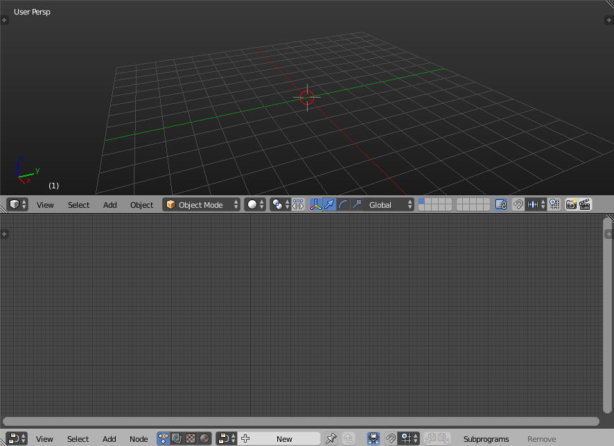
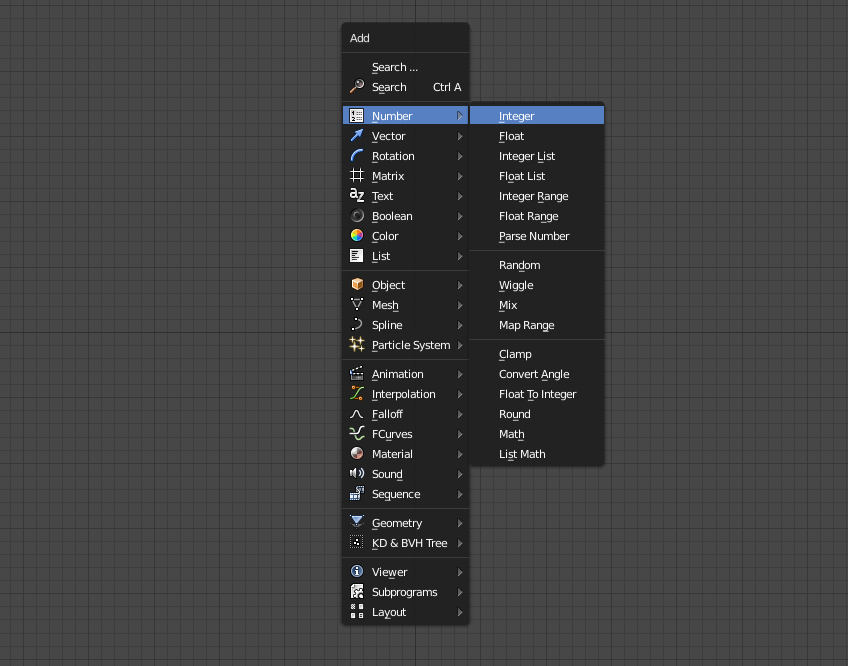
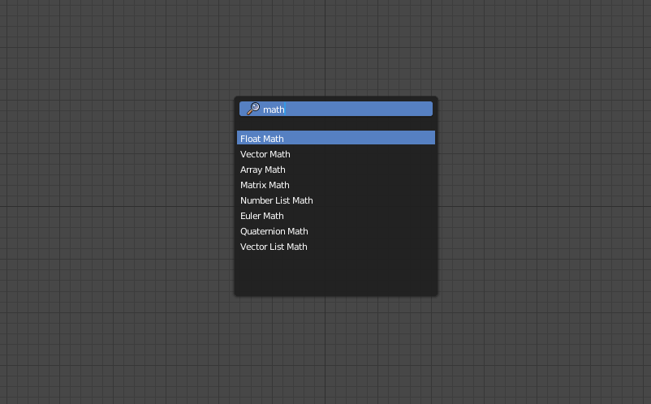
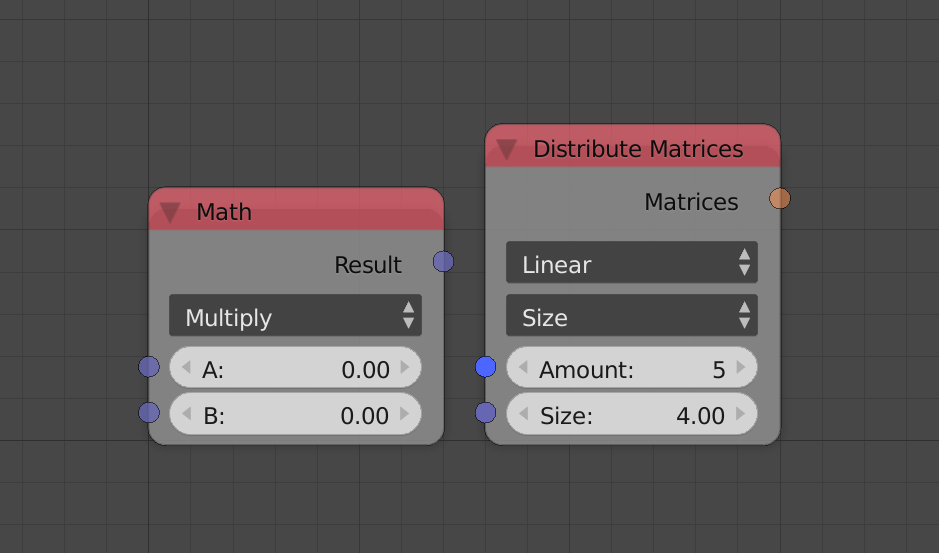
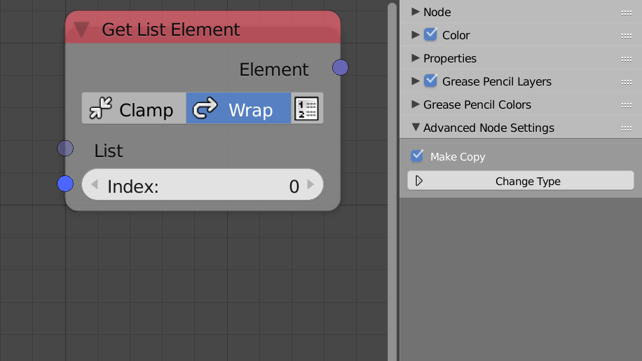
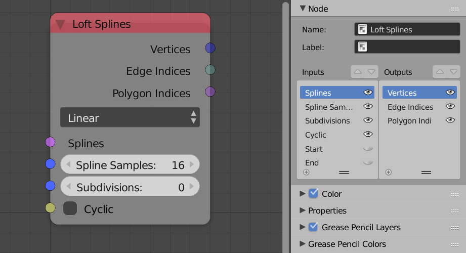
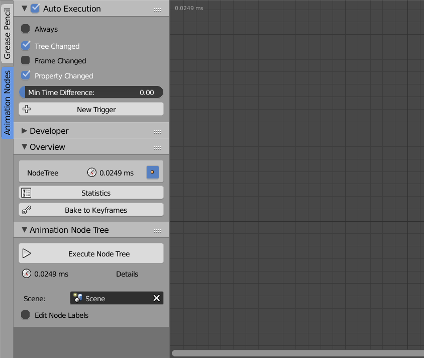
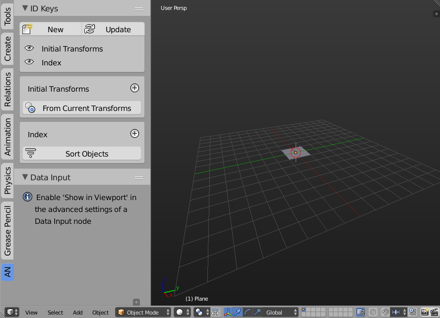
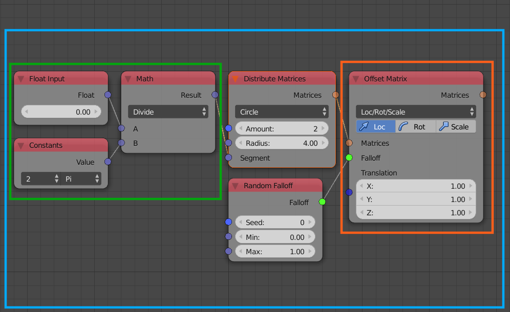

Much of the interface is located in the node editor while the rest of
the interface exists in other regions like the 3D viewport.

Animation Nodes have its own node editor which you can select by
clicking on the Dope Sheet icon
 in the tool bar. A new
node tree can be added by clicking on the **New** button.

## Node Menu

To add a new node, you can open the Node Menu by pressing `Shift+A` just
like other node systems. The menu contains a group of submenus each of
which contains a list of node categorized by their type. The menu
includes all the nodes in Animation Nodes except for some *passive
nodes*. Passive nodes are nodes that can only be added through the
**Search Menu** which is covered in the next section.

Passive nodes are usually added automatically whenever needed, for
instance, *Parse Number* node is automatically added when attempting to
connect a text type to a number type:



## Search Menu

The search menu can be opened by pressing `Ctrl+A`, it enables you to
quickly find and insert nodes by their names. Some nodes have multiple
names for faster access. Moreover, some nodes have the so called "search
tags" which are option presets, for instance, searching for "Add,
subtract, multiply, ..." will add a math node and set it to the required
type. The search menu can find any node in Animation Nodes even if it
was passive.

## Node Settings

### Inside the Node

Options that users use often are drawn inside nodes, for example:

Math operation and distribution patterns are node options.

### Advanced Node Settings

Options that users don't use often are drawn in a custom panel called
**Advanced Node Settings** to avoid clustering the UI.

## Node Panel

Sockets (Inputs and Outputs) of nodes can be hidden or unhidden through
this panel by pressing the "eye" next to the desired socket. Some nodes
like subprograms, allows reordering of sockets by using the **arrows**.
You can also change the name and label of nodes in this panel, names has
to be unique.

## Tree Settings

The tool menu in the node editor in Animation Nodes contain settings and
information regarding the nodetree itself. All of the options will be
explained in other sections of the getting started guide.

### Auto Execution Panel

Include options related to auto execution of the node tree.

### Developer

Include options related to inspecting, profiling and debugging node
trees.

### Overview

Include some information about the node tree like the execution time.
The statistics button draws a table that include information about the
number and types of nodes in the node tree.

### Animation Nodes Tree

This panel includes manual execution button and the scene that the node
tree belongs to.

  - **Edit Node labels** - If enabled, a text box will appear in every
    node that lets you edit the label of the node. This is particularly
    helpful if you want to organize you node tree after you finished
    building it.

## 3D View

### ID

Includes some options related to the
`/user_guide/nodes/object/object_id_key` node.

### Data Input

Displays the the data input nodes inside the panel if **Show In
Viewport** is enabled.

## Shortcuts

### U

Upon pressing **U** while selecting a node, a panel that include both
the *Advanced Node Settings* and the *Socket Settings* of the selected
node will appear. This is considered as a more robust way to edit the
settings instead of promoting the **N** menu:



### W

Upon pressing **W** while selecting a node, a pie menu will be promoted
that include up to three operators depending on the selected node, those
operators include:

#### Data Input

This is only available if the node has **Visible** inputs. It will
create an *Input Node* for the selected node's input socket (or the only
existing one):



#### Viewer

This is only available if the node has **Visible** outputs. It will
create a *Viewer Node* for the selected node's output socket (or the
only existing one):



#### Loop Through

This is only available if the node has **Visible** list outputs. It will
create a *Loop Input Node* with an iterator of the same type as the
selected node's output socket (or the only existing one), as well as
create an *Invoke Node* pointing to the created loop connecting the
selected node's output to the created iterator:



#### Create Invoke Node

This is only available if the node is a *Loop Input Node*. It creates an
*Invoke Node* pointing to the selected loop:



### E

Upon pressing **E** while selecting a node, a pie menu will be promoted
that include three operators that allows selecting relatives of the
selected node, those operators include:

#### Selected Dependencies

This will select all the nodes that the selected node depends upon, that
is, nodes connected to its inputs. Green in the illustration below.

#### Selected Dependent Nodes

This will select all the nodes that uses the selected node, that is,
dependent on it. Orange in the illustration below.

#### Selected Network

This will select all dependencies and dependent nodes as well of that of
them of the selected node, that is, any node connected to the selected
node. Blue in the illustration below.

### Tab

**Tab** if pressed while selecting a *Loop Input Node*, will select all
the *Invoke Nodes* pointing to it. And if pressed while selecting an
*Invoke Node*, will select the *Loop Input Node* of the loop it is
pointing to. This works across node trees, so if a loop is defined in
another node tree, Animation Nodes will switch to that node tree, in
that case, pressing **Tab** again will---in some scenarios---switch back
to the node tree you were originally at.

### Ctrl + Shift + Q

This will disable *Auto Execution*.

