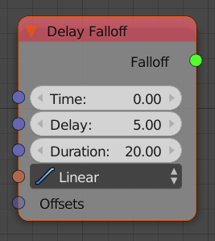

## Description

This node creates an index based falloff that associates a float that
increases as the time increases where objects at indicies that are
closer to zero starts increasing before those that are farther away from
zero. User can control the rate of increasing relative to time and
indices.

## Illustration



The vertices of the line are suppose to move one unit in the z-axis but
since I used the **Delay Falloff** as a factor, the offset depend on
time. We notice, as the time increase, the vertex at first index start
moving, the vertex at the second index didn't start moving till the time
became `5` which is the **Delay** input, the vertex at the first index
stopped moving when time reached `10` which is the **Duration** input.
So we conclude that input **Delay** is the time it takes for an object
to start moving relative to the previous object while the input
**Duration** is the amount of time it takes for every object to reach
its maximum value which is `1`. The output is also evaluated at the
input interpolation.

## Inputs

- **Time** - The current time.
- **Delay** - Time span between the animation start of two successive
    objects.
- **Duration** - Time it takes for an object to reach its maximum
    value (1).
- **Interpolation** - The output is evaluated at this input
    interpolation or the velocity function of the animation.
- **Offsets** - When given, it specifies how much each object is
    offset in time.

## Outputs

- **Falloff** - The actual falloff object.

## Advanced Node Settings

- N/A

## Examples of Usage


