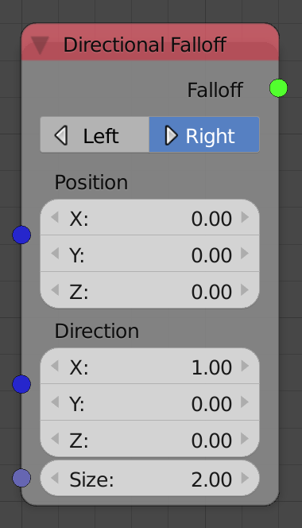

## Description

This node creates a vector based falloff that associates to every object
a float that is equal to inverse the distance to some point along some
arbitrary direction vector. This float is always in `[0,1]` range, So
some distances will be clamped to `1` or `0`. We conclude that objects
that are closer to the input point along the defined directional vector
will have a large float that doesn't exceed `1` and as objects gets
away, their floats starts to fade till it becomes zero at some point.

## Options

- **Left** - Objects that are on the negative side of the direction
    vector will be zeroes. Object that are on the positive side will
    start increasing as the distance increase till they reach one.
- **Right** - Objects that are on the negative side of the direction
    vector will be ones. Object that are on the positive side will start
    decreasing as the distance increase till they reach zero.

## Inputs

- **Position** - The position of the point.
- **Direction** - The direction vector.
- **Falloff Width** - A float that is multiplied by the floats, can be
    though of as the slope of decreasing or increasing.

## Outputs

- **Falloff** - The actual falloff object.

## Advanced Node Settings

- N/A

## Examples of Usage


