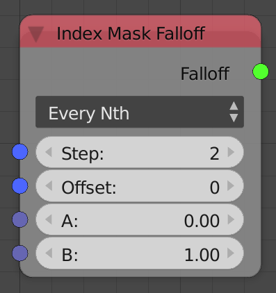

## Description

This node creates an index based falloff that associates one of two
input floats to every object. The node supports random assignment of
floats as well as every Nth object assignment.

## Options

- **Every Nth** - This option assign input float A to indices that are
    divisible by some input integer `n` and input float B to indices
    that aren't. If `n` was `2` then the pattern will be `BABABABA`
    because even numbers are divisible by `2` while odd aren't. If `n`
    was 3 then the pattern will be `BBABBABB` because `3,6,9` are
    divisible by `3` while other numbers aren't.
- **Random** - This option assign input float A and B randomly but
    limited with some probability. If the probability is `1` all objects
    will have float B, if zero all object will have float A, if `0.5`
    half of the object will have A and the other half will have B. But
    it is a probability so it is not guaranteed.

## Inputs

- **Step** - An integer to check divisibility against. See **Every
    Nth** option above. (Only available in **Every Nth** option)
- **Offset** - This integer is added to the index of every object. It
    acts as an offset for the pattern, so pattern `ABABAB` offset by `1`
    will be `BABABA`. (Only available in **Every Nth** option)
- **Seed** - Seed of the random generator. (Only in the **Random**
    option)
- **Probability** - The probability that float B will be assigned to
    objects. See **Random** option above. (Only in the **Random**
    option)
- **A** - Float A. Can be between zero and one.
- **B** - Float B. Can be between zero and one.

## Outputs

- **Falloff** - The actual falloff object.

## Advanced Node Settings

- N/A

## Examples of Usage


