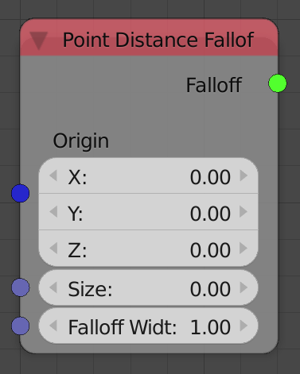

## Description

This node creates a vector based falloff that associates to every object
a float that is equal to inverse the distance to some point. This float
is always in `[0,1]` range, So some distances will be clamped to `1` or
`0`. We conclude that objects that are closer to the input point will
have a large float that doesn't exceed `1` and as objects gets away,
their floats starts to fade till it becomes zero at some point.

## Illustration

In this illustration, I set the z-position of the points of a line to
their falloff floats which formed some kind of triangle. As we said, the
float is equal to inverse the distance from the point to some arbitrary
point which I defined as the `(0,0,0)` point in this illustration. Let
the distance be `D`, then inverse of the distance is `1-D`. So point
`(0,0,0)` will have a `D` of `0` (because distance between `(0,0,0)` and
`(0,0,0)` is zero) and a `1-D=1-0=1`, that's why the point in the middle
have a z-location of `1`. Point `(1,0,0)` on the other hand have a `D`
of `1` and a `1-D=1-1=0` , that's why the point at `(1,0,0)` has a
z-location of zero. Points further away will have a negative inverse
distances and thus negative z-locations. But as we said, values are
clamped to `[0,1]` range and so negative floats will be zeroes and
floats larger than one will be equal ones (We currently don't have
values larger than one).

What I am going to do is add some value to the floats which result in
inverse distances larger than one which will then be clamped to one,
since the inverse distance is the z-location of the points, adding a
value to the float will result in moving the triangle in the
z-direction. The illustration shows what happens when this value is
added when clamping is present.

Furthermore, multiplying the floats by some value will change the rate
of changing of the floats and thus have a wider based triangle, which is
shown in the illustration as scaling the triangle which is what
multiplication graphically denote.

In the node inputs, input **Offset** is the value that gets added while
input **Width** is the value that gets multiplied.

Shaded area is the actual points position after clamping, outline is the
values before clamping. Notice how outline exceed one and deceed zero:



## Inputs

  - **Origin** - The position of the point.
  - **Offset** - This float is added to the floats of every object. It
    acts as an offset for the distances.
  - **Falloff Width** - A float that is multiplied by the floats, can be
    though of as the slope of decreasing.

## Outputs

  - **Falloff** - The actual falloff object.

## Advanced Node Settings

  - N/A

## Examples of Usage


