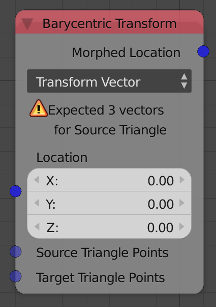

## Description

This node perform a barycentric transformation from a triangle to
another.

## Demonstration

Any point that lies on a triangle can be described in terms of the
vertices of that triangle using what is known as a convex combination. A
convex combination is a linear combination of points (vectors) where all
coefficients are non-negative and sum to 1. If the point is close to one
of the vertices of the triangle, then its coefficient will be the
largest.

The barycentric transform node compute the coefficients of the convex
combination that describe the input point in the input source triangle,
then it uses those coefficients to compute the location of the point
that lie on the input target triangle through a convex combination of
its vertices, see the below illustration if you didn't get it.



## Inputs

  - **Location** - The location of the point that lies on the source
    triangle.
  - **Source Triangle Points** - The location of the vertices of the
    triangle used to compute the coefficients of the convex combination
    from.
  - **Target Triangle Points** - The location of the vertices of the
    triangle to apply the convex combination to.

## Outputs

  - **Morphed Location** - The location of the point resulted from the
    convex combination.

## Advanced Node Settings

  - N/A

## Examples of Usage


