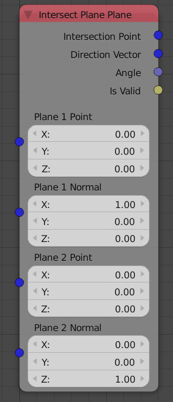

## Description

This node returns the intersection line of two input planes. A plane
intersect another plane in a straight line. There are multiple
representations of this straight line, one of which is the vector form,
which represent it using a point and a unit vector defining its
direction, this is the form that the node uses. This point could have
been in any location along the intersection line, but the node tries to
minimize the distance to the origin as much as possible, so it chooses
the point along the line that is closest to the origin point.

## Illustration

Orange point is the intersection point and blue vector is the direction
vector.

## Inputs

  - **Plane 1 Point** - A point on the first required plane.
  - **Plane 1 Normal** - A unit vector that represent the normal of the
    first required plane.
  - **Plane 2 Point** - A point on the second required plane.
  - **Plane 2 Normal** - A unit vector that represent the normal of the
    second required plane.

## Outputs

  - **Intersection Point** - The location of the closest point to the
    world center that is on the line of intersection of the planes.
  - **Direction Vector** - A unit vector that describe the direction of
    the line of intersection of the two planes.
  - **Angle** - The angle between input planes in radians.
  - **Is Valid** - A boolean which is True if an intersection was found
    and False otherwise. If it is False, that means that the planes are
    parallel or identical.

## Advanced Node Settings

  - N/A

## Examples of Usage


