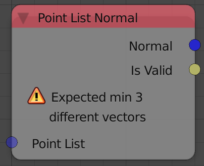
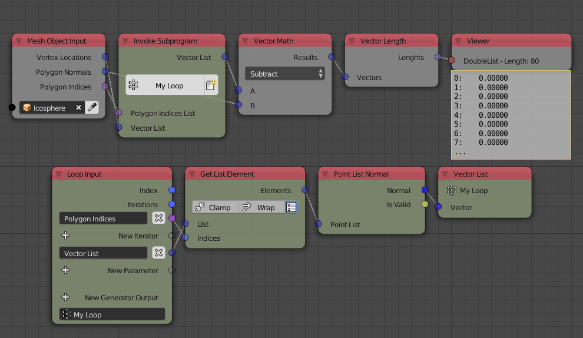

## Description

This node takes multiple vectors representing the points of a polygon
and computes the normal of that polygon. At least 3 points are needed to
compute the normal. If more than 3 noncoplanar points were input, the
computed normal will be the average of the normals of each 3 points. If
the points are collinear, the node will return a zero vector because no
norml can be computed.

## Inputs

  - **Point List** - A vector list that contain the locations of the
    polygon's points.

## Outputs

  - **Normal** - A unit vector representing the normal of the polygon. A
    zero vector if points weren't valid, that is, collinear.
  - **Is Valid** - A boolean which is True if the points are not
    collinear and False otherwise.

## Advanced Node Settings

  - N/A

## Notes

The order of points matter, because the cross product is used to compute
the normals. So, reversing the order of points reverse the direction of
the normal.

## Examples of Usage

The normal of a triangle formed from three points is computed using the
*Point List Normal* node, this normal, in turn, is used to orient a
cylinder such that its principal axis aligns with the normal of the
triangle. Moreover, the cylinder is positioned in the center of the
triangle, which is computed by taking the average of the points.



The polygon normals output of the *Mesh Object Input* node is identical
to the normals computed using the *Point List Normal* node.

