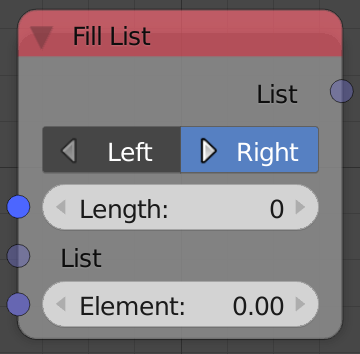

## Description

This node takes an input list and change its length by inserting an
arbitrary number of the input element.

The **Length** input define the length of the output list, if the input
list length was smaller than that number, then the input **Element**
will be added till the length matches that of **Length** input. For
instance, `[1,2]` as input list with **Length** equal to 5 and and
**Element** as `11`, the output list will be `[1,2,11,11,11]`, notice
how `11` was added several times to form a list of length `5`.

If the input list was larger than **Length** input then nothing happens
to the list. Moreover, an empty input list would output a list of length
input **Length** that is filled with the input **Element**, that's why
the node is called Fill.

## Options

  - **Right** - If chosen, the elements will be added at the end of the
    list.
  - **Left** - If chosen, the elements will be added at the start of the
    list.

## Inputs

  - **List** - An input list.
  - **Length** - The length of the output list.
  - **Element** - The element used in filling the empty spaces.

## Outputs

  - **List** - The filled list.

## Advanced Node Settings

  - **Make Element Copies** - If enabled, the **Element** input will be
    copied before inserting, this makes sure the elements are
    independent of the original element used. This option don't work for
    non objects, so it won't be available if the input list was of float
    or integer type.

## Examples of Usage


