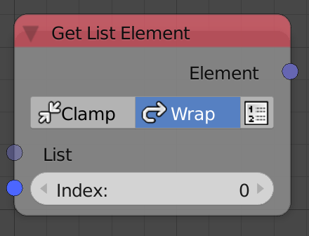

## Description

This node returns the element at the input index. So if the input index
is 1 and the input list is `[1,2,3]` then the output will be 2. (Notice
that indices start from 0 and not 1)

## Options

  - **Clamp Index** - If enabled, the output will be the last element if
    the index is larger than or equal the list length, furthermore, the
    output will be the first element if negative indices were used
    assuming **Wrap** option is disabled while if it was enabled, the
    output will be the first element if absolute the index is larger
    than or equal the list length. If disabled, fallback value will be
    used. (see inputs)
  - **Wrap** - If enabled, negative indices will be allowed where `-1`
    means the last element, `-2` means the second last element and so
    on.
  - **Use Index List** - It is the option you see beside **Wrap**, if
    enabled, the index will be an integer list and the output will the a
    list that contains the elements at the indices defined in the input
    integer list.

## Inputs

  - **List** - An input list.
  - **Index** - The index of the output element.
  - **Fallback** - This value is an arbitrary value that is output when
    **Clamp Index** is disabled and the index is larger than or equal
    the list length, or when **Wrap** is disabled and negative indices
    were used, or when **Wrap** is enabled and the absolute of the index
    is larger than or equal the length of the list.

## Outputs

  - **Element** - The element at index *Input Index*

## Advanced Node Settings

  - **Make Copy** - Copy the element before outputting it. This makes
    sure the element is independent of the original element in the list
    and so changing that element won't affect the output.
  - **Change type** - Change the type of the list to another list type.

## Examples of Usage


