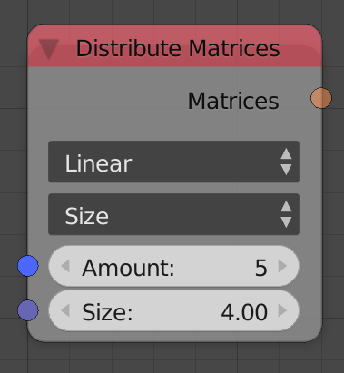

## Description

This node creates a list of matrices that represent the locations of
object distributed someway in space. They can be distributed in a line,
grid, circle or based on a custom distribution.

## Options And Inputs

  -   - **Linear** - This option distribute matrices along the x-axis
        centered at the world.
        
          -   - **Size** - This option lets you define the size of the
                line.
                
                  - **Amount** - Number of matrices.
                  - **Size** - Size of the line.
        
          -   - **Step** - This option lets you define the distance
                between each two consecutive matrices.
                
                  - **Amount** - Number of matrices.
                  - **Distance** - Distance between each two consecutive
                    matrices.

  -   - **Grid** - This option distribute matrices on a 3D lattice
        centered on the world with positive z-locations.
        
          -   - **Size** - This option lets you define the side length
                of the lattice.
                
                  - **X Division** - Number of matrices in x-axis.
                  - **Y Division** - Number of matrices in y-axis.
                  - **Z Division** - Number of matrices in z-axis.
                  - **Width** - The width of the lattice.
                  - **Length** - The length of the lattice.
                  - **Height** - The height of the lattice.
        
          -   - **Step** - This option lets you define the distance
                between every two object in all axis.
                
                  - **X Division** - Number of matrices in x-axis.
                  - **Y Division** - Number of matrices in y-axis.
                  - **Z Division** - Number of matrices in z-axis.
                  - **X Distance** - Distance between each two
                    consecutive matrices along x-axis.
                  - **Y Distance** - Distance between each two
                    consecutive matrices along y-axis.
                  - **Z Distance** - Distance between each two
                    consecutive matrices along z-axis.

  -   - **Circle** - This option lets you distribute object around a
        circle centered at the world.
        
          - **Amount** - The number of matrices around the circle.
          - **Radius** - Radius of the circle.
          - **Segment** - A ratio that describe the completeness of the
            circle, where `1` means a a complete circle and `0` means no
            circle.

  -   - **Vertices** - This option lets you distribute objects based on
        a vector list that define their location and another vector list
        that defines their orientation.
        
          - **Vertices** - A vector list that represents the locations
            of the matrices.
          - **Normals** - A vector list that represents the orientation
            of the matrices.
          - Note that both lists have to have the same length and the
            number of output matrices will be equal to the length of the
            lists.

## Outputs

  - **Matrices** - The output matrices.

## Advanced Node Settings

  - N/A

## Examples of Usage


