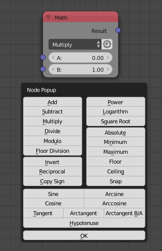

## Description

This node performs 26 math operations:

  - **Add** - Adds input A to input B.
  - **Subtract** - Subtract input B from input A.
  - **Multiply** - Multiplies input A by input B.
  - **Divide** - Divides input A by input B.
  - **Sine** - Calculate the sine of input A.
  - **Cosine** - Claculate the cosine of input A.
  - **Tangent** - Calculate the tangent of input A.
  - **Arcsine** - Calaculate the arcsine of input A.
  - **Arccosine** - Calculate the arccosine of input A.
  - **Arctangent** - Calculate the arctangent of input A.
  - **Power** - Returns input A to the power of input B.
  - **Logarithm** - Returns the logarithm of input A to the base input
    B.
  - **Minimum** - Returns the smallest value from input A and input B.
  - **Maximum** - Returns the largest value from input A and input B.
  - **Modulo** - Returns the remainder of divinding input A by input B.
  - **Absolute** - Returns the positive value of input A.
  - **Floor** - Returns the whole number of input A.
  - **Ceiling** - Returns the next whole number after input A.
  - **Square Root** - Returns the square root of input A.
  - **Invert** - Flips the sign of input A.
  - **Reciprocal** - Returns the mathematical inverse of input A (1/A).
  - **Snap** - Snaps input A to the whole multiples of the Step Size.
  - **Arctangent B/A** - Returns the arctangent of input B divided by
    input A.
  - **Hypotenuse** - Returns the length of the hypotenuse given the side
    length input A and B.
  - **Copy Sign** - Returns input A with the sign of input B.
  - **Floor Division** - Returns the whole number of input A divided by
    input B.

## Inputs

Inputs are dynamic, meaning the node has either one or two inputs based
on selected operation.

## Outputs

  - **Result** - The result of the math operation.

## Advanced Node Settings

  - **Remove Quick Settings** - You may notice that when duplicating a
    math node, couple of buttons appear along with a green check mark.
    Those are called **Quick Settings**, clicking on one of the buttons
    change the type of the math node to the type of the button. The
    check mark is a way to tell AN that the current type is what you
    want and that you no longer need the menu. This button in the
    advanced node settings is equivalent to pressing the check mark for
    all math nodes in the node tree.



## Notes

  - Division by 0 returns 0.0.
  - Modulo by 0 returns 0.0.
  - Logarithm with the base \<=0 or =1 takes the natural logarithm.
