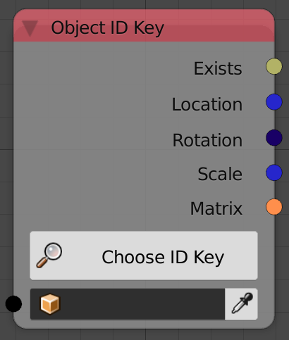

## Description

This node returns the values of a specific ID key.

ID keys are are values that are set to objects and they are constants
unless you update them. An example would be storing the initial
transformation of an object in an ID key and then access it for
different reasons using the Object ID key node.

## Inputs

  - **Object** - An input object.

## Outputs

The outputs are based on the type of the ID key, however, if the ID key
was an initial transformations ID key, the outputs will be as follow:

  - **Exist** - A boolean which is False if a key doesn't exist and True
    if it does.
  - **Location** - A vector which contain the location in the key.
  - **Rotation** - An euler which contain the rotation in the key.
  - **Scale** - A vector which contain the scale in the key.
  - **Matrix** - A transformation Matrix stored in the key

## Advanced Node Settings

  - N/A

## Examples of Usage

ID keys are particularly useful when one want to transform some objects
relative to their original position. (One can also use the delta
transforms in the Transforms Output Node)

For instance, if I want to move an object 2 units in the x direction, if
I used its current location and added 2 to it, it will just keep moving
forever because its new location will be its current location in the
next node execution, So to solve this problem, I can store the object
position in an ID key and then add 2 to it.


