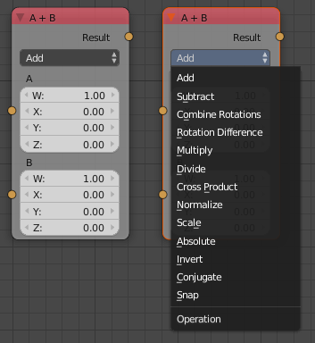

## Description

This node carries 13 quaternion math operation:

  - **Add** - Adds input quaternion A to input quatrnion B.
  - **Subtract** - Subtracts input quaternion B from input quaternion A.
  - **Combine Rotation** - Hamilton product of input quaternion A by
    input quaternion B.
  - **Rotation Difference** - Returns a quaternion that is the
    difference between input quaternion A and input quaternion B.
  - **Multiply** - It multiplies the elements of input quaternion A by
    input quaternion B (element wise operation).
  - **Divide** - It divides the elements of input quaternion A by input
    quaternion B (element wise operation).
  - **Cross Product** - Returns a quaternion that is perpendiculat to
    the input quaternions.
  - **Normalize** - Sets the magnitude of the input quaternion to a
    specific length.
  - **Scale** - Perform a scalar multiplication to the input quaternion.
  - **Absolute** - Absolute all the components of the input quaternion.
  - **Invert** - Multiply the input quaternion by -1.
  - **Conjugate** - Multiply the vector part of the quaternion by -1.
  - **Snap** - Snaps the components of the input quaternion to a defined
    step size for each component.

## Operations on Quaternion:

  - **Addition** - Elementwsie addition of the quaternion elements.
  - **Subtraction** - Elementwsie subtraction of the quaternion
    elements.
  - **Combine Rotation** - This is what is known as **Hamilton
    product**, it is basically like rotating an object by the first
    quaternion then rotating by the second to get the final rotation of
    the object.
  - **Rotation Difference** - Returns a quaternion that if combined with
    the first quternion will produce the second quaternion.
  - **Multiply** - Elementwsie multiplication of the quaternion
    elements.
  - **Divide** - Elementwsie division of the quaternion elements.
  - **Cross Product** - The cross product of 2 quaternions is a Hamilton
    Product. In fact we can express quaterniom multiplication using
    Cross Product.
  - **Normalization** - This operation just set the length of the
    quaternion to a specific length, and it doesn't change that
    quaternion in terms of it's representation of rotations,because the
    quaternion still maintain its direction in the 4D space and when
    used as rotation, it get normalized and stay the same.
  - **Scale** - Just like normalize but it multiplies the current length
    by a factor.
  - **Absolute** - It Absolutes all the elements of the quaternion.
  - **Invert** - Multiplies all the elements of the quaternion by -1.
  - **Conjugate** - The conjugate of the quaternion `w,x,y,z =
    w,-x,-y,-z`.
  - **Snap** - Snap the individual elements to a specific step size. Put
    in mind that quaternion rotation is not linear, so you may not get
    what you want out of quaternion.

## Inputs

  - **Quaternion A** - The first quaternion.
  - **Quaternion B** - The second quaternion.

(Inputs are dynamic, Means the node has either one or two inputs based
on selected operation. Those inputs can also be scalar or quaternion
based on the operation)

## Outputs

  - **Result** - The result of quaternion math operations.

## Advanced Node Settings

  - N/A

## Examples Of Usages


