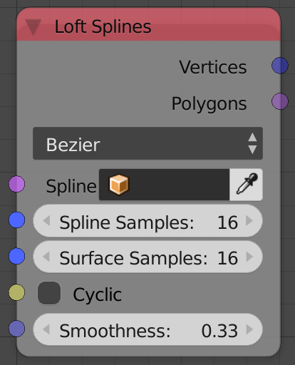
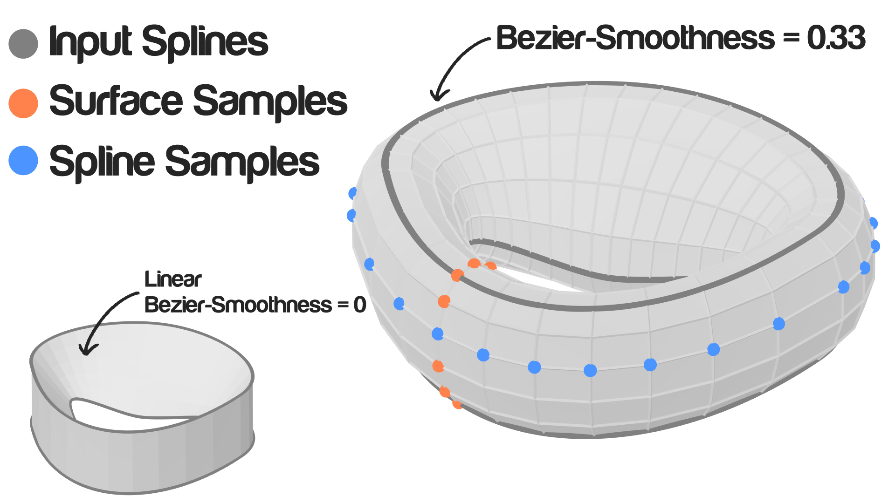

## Description

This node generates a mesh by sampling some points on the input splines
and bridge (connect) them in order.

## Options

- **Bezier** - This option will use a bezier interpolation to locate
    the segments of the bridge between the splines and thus having a
    smooth output mesh.
- **Linear** - This option will use a linear interpolation to locate
    the segments of the bridge between the splines and thus having a
    flat connection between the splines.

If the **Surface Samples** is set to 2 or the **Smoothness** is set to
zero, the bezier interpolation will work just as a linear interpolation.

## Illustration

## Inputs

- **Splines** - A list of splines to be connected.
- **Spline Samples** - The amount of vertices sampled and used to
    create the mesh.
- **Surface Samples** - The amount of segments created between the
    splines.
- **Cyclic** - A boolean which if true will connect the polygons
    vertically and thus having a manifold object.
- **Smoothness** - A factor that define the smoothness of the beizer
    interpolation.(Only when using Bezier option)
- **Start** - The normalized distance at which the first loop will
    start.
- **End** - The normalized distance at which the first loop will end.

## Outputs

- **Vertices** - A vector list that contains the vertices locations of
    the output mesh.
- **Polygons** - A polygon indices list that carry the polygons
    information of the output mesh.

## Advanced Node Settings

- **Spline Distribution** - The method used to sample spline samples
    (see Evaluate Spline Node for more info)
- **Surface Distribution** - The method used to sample surface
    segments (see Evaluate Spline Node for more info)
- **Resolution** - The number of handles used to create the spline
    used to perform the evaluation when using the Uniform Distribution.

## Examples of Usage


