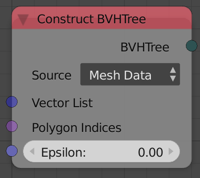

## Description

This node constructs a BVH Tree from the input mesh data.

## Demonstration

BVH trees or Bounding Volume Hierarchy trees are tree data structures
that classify objects in a tree structure which then can be used in:

- **Ray Tracing**
- **Collision Detection**

BVH trees are convenient to do ray tracing and collision detection
because they are a lot faster than traditional ray intersection
operations.

## Inputs

- **Vector List** - A vector list that contain the locations of the
    vertices of the mesh.
- **Polygon Indices** - A polygon indices list that contain the
    polygon indices of the mesh.
- **Epsilon** - It is the intersection threshold, it tells the BVH
    tree how close can a point be to the mesh so that it can be
    considered an intersection. So a high epsilon value will consider a
    point that haven't reached the mesh surface yet an intersection. It
    is not recommended to use a high epsilon value as it can be very
    slow.

## Outputs

- **BVHTree** - The output BVHTree.

## Advanced Node Settings

- N/A

## Examples of Usage


