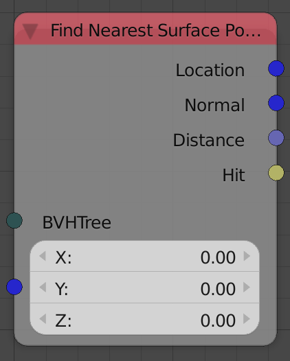

## Description

This node find the nearest point on the surface of the mesh defined by
the BVH tree to the input point.

## Inputs

  - **BVH** - A BVH tree that represents the mesh you want to find the
    point on.
  - **Vector** - A vector that represents the location of the point to
    find the point nearest to it.
  - **Max Distance** - It is the distance from the input vector at which
    the node stop searching and return nothing.

## Outputs

  - **Location** - A vector that represents the location of the nearest
    point if there was any. (It is a null vector if there wasn't any)
  - **Normal** - A unit vector that represents the surface normal at the
    nearest point if there was any. (It is a null vector if there wasn't
    any)
  - **Distance** - The distance between the input vector and the nearest
    point if there was any. (It is zero if there wasn't any)
  - **Polygon Index** - The index of the polygon that the nearest point
    belong to if there was any. (It is -1 if there wasn't any)
  - **Hit** - A boolean which is True if a nearest point was found and
    False otherwise.

## Advanced Node Settings

  - N/A

## Notes

  - The only situation where a point can't be found is when the distance
    between the input vector and its nearest surface point is larger
    than the input max distance.

## Examples of Usage


