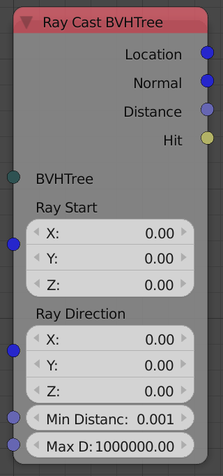

## Description

This node sends a ray through the scene and gather some information
about its intersection with the mesh defined by the BVH tree.

## Options

- **Start At Infinity** - If enabled, the ray will start from an
    infinitely far point along the line defined by the input Ray
    Direction and Ray Start (Which in this case doesn't represent the
    actual starting point but just the position of the ray). Max
    distance input will also be unusable if enabled.

## Inputs

- **BVH** - A BVH tree that represents the mesh you want to intersect
    the ray with.
- **Ray Start** - A vector that represents the starting point of the
    ray.
- **Ray Direction** - A vector that represents the direction of the
    ray. It doesn't have to be normalized.
- **Min Distance** - It is distance from the ray start at which
    intersections are starting to be considered.
- **Max Distance** - It is the distance from the ray start at which
    intersections are not considered anymore.

## Outputs

- **Location** - A vector that represents the location of the point of
    intersection if there was any. (It is a null vector if there was no
    intersection)
- **Normal** - A unit vector that represents the surface normal at the
    point of intersection if there was any. (It is a null vector if
    there was no intersection)
- **Distance** - The distance between the ray start and the point of
    intersection if there was any. (It is zero if there was no
    intersection)
- **Polygon Index** - The index of the polygon that the ray intersect
    if it did. (It is -1 if there was no intersection)
- **Hit** - A boolean which is True if there was an intersection and
    False otherwise.

## Advanced Node Settings

- N/A

## Notes

- Adjusting minimum and maximum distances won't affect the speed of
    the ray cast.
- If you want to define the ray by 2 points one of them is the
    starting point, linear algebra tells you to subtract your second
    point from your starting point then plug it as the ray direction.

## Examples of Usage


