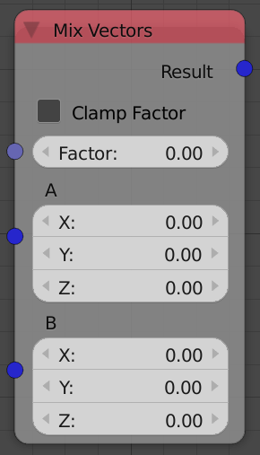

## Description

This node linearly mixes between two vectors based on a factor.

## Options

- **Clamp** - If enabled, a factor that is larger than one will be
    rendered one and a factor that is negative will be rendered zero.
    Subsequently, the output's elements will be in the range of the
    input vectors' elements. If disabled, the result is computed based
    on the equation A(1-F)+B\*F (Where
    F is the factor,
    A and
    B are the first and second vectors)
    which accordinging may result in strange results for negative
    factors or factors that are larger than one.

## Inputs

- **Factor** - A float that controls the amount of each vector input
    to the output, where 0 means the first vector only and 1 means the
    second vector only.

## Outputs

- **Result** - The result vector of mixing the two vectors by the
    input factor.
- **A** - First vector.
- **B** - Second vector.

## Advanced Node Settings

- N/A

## Examples of Usage


