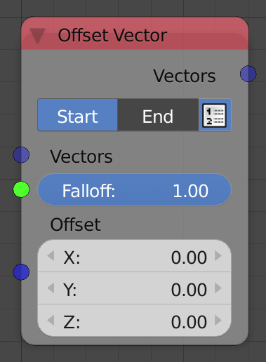

## Description

This node offset the input vector(s) based on an input offset vector
with an input falloff as a factor. It is a linear interpolation between
the input vector(s) and the input vector(s) plus the offset vector where
the factor of the interpolation is the falloff value.

## Options

  - **Start/End** - *Start* will return the input vectors when the
    falloff is minimum (zero) and the input vectors plus the offset
    vector when the falloff is maximum (one). *End* on the other hand
    will return the input vectors plus the offset vector when the
    falloff is minimum (zero) and the input vectors when the falloff is
    maximum (one).
  - **Use Vector List** - It is the button you see beside the
    *Start/End* options, if is enabled, the node will expect a vector
    list to offset and the output will be the offset vector list.

## Inputs

  - **Vector(s)** - A vector(s) to offset.
  - **Falloff** - A falloff to use as a factor.
  - **Offset** - The offset vector.

## Outputs

  - **Vector(s)** - The resulted vector(s).

## Advanced Node Settings

  - N/A

## Examples of Usage



If *End* is used instead of *Start*, the animation reverse:




