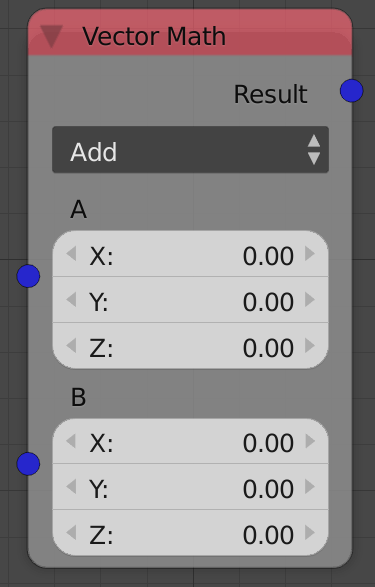

## Description

This node performs 11 vector math operations:

  - **Add** - Add input vector A to input vector B.
  - **Subtract** - Subtract input vector B from input vector A.
  - **Multiply** - Multiply the components of input vector A by the
    components of input vector B.
  - **Divide** - Divide the components of input vector A by the
    components of input vector B.
  - **Cross product** - Returns the cross product of input vector A and
    input vector B.
  - **Project** - Returns the projection of input vector A onto input
    vector B.
  - **Reflect** - Returns the reflection vector of input vector A with
    normal as input vector B.
  - **Normalize** - Set the magnitude of the input vector to a specific
    length.
  - **Scale** - Perform a scalar multiplication to the input vector.
  - **Absolute** - Absolute all the components of the input vector.
  - **Snap** - Snap the the components of the input vector to a defined
    step size for each component.

## Inputs

  - **Vector A** - The first vector.
  - **Vector B** - The second vector.

(Inputs are dynamic, Means the node has either one or two inputs based
on selected operation. Those inputs can also be scalar or vectors based
on the operation)

## Outputs

  - **Result** - The result of vector math operations.

## Advanced Node Settings

  - N/A

## Notes

  - The **Project** operation will project the vector A on the extension
    of vector B regardless of its length.

## Examples of Usage

If the location of a point is defined by some vector `A`, and we add
some vector `B` to it, `A` gets moved in the direction of vector `B`.
Moreover, if `B` was set to the length of some scalar `m` using
normalize operation, the vector `A` will move in the direction of `B`
`m` units. A common node tree uses `A` and `B` as the location and the
normal of the vertices respectively to achieve the following effect:



Dividing the space by some vector spatially scales whatever function you
have:



The reflection of a vector from the `xy` plane:


