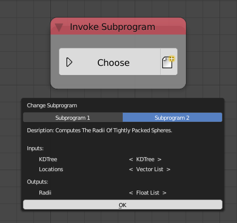

Invoke a subprogram defined in any of the node trees in the scene. The
*Choose* button lets you choose the required subprogram to invoke, a
list of subprograms will be promoted listing their descriptions, inputs
and outputs.

We can see that there are two subprograms in the scene, *Subprogram 1*
and *Subprogram 2*, the latter of which has two inputs, *KD Tree* and
*Locations* of type *KD Tree* and *Vector List* respectively and one
output *Radii* of type *Float List* as well as a description describing
what the subprogram does.

The node also have an *Insert Empty Subprogram* operator which will add
an empty subprogram definition of a type of your choosing and set it as
the required subprogram to invoke.

## Caching

The invoke node provides a caching mechanism for Animation Nodes.
Caching is the process of storing the outputs of the subprogram in
memory, in future executions, the subprogram is not executed and
instead, the stored output is returned. The node provides three
mechanisms for storing and updating the cache, that is, recomputing the
outputs and storing them. The cache can be cleared to force
recomputation of the outputs.

Note

Cache is automatically cleared whenever the subprogram definition
change.

The caching options are available in the *Advanced Node Settings* of the
node which include an option *Show Cache Options* that shows the options
in the node itself. Caching is disabled by default and if enable can be
cleared by pressing the *Clear Cache* button.

### One Time

This mechanism stores the cache and never updates it unless it was
cleared. A typical use for this mechanism is to cache data that are
expensive to compute yet it never changes, by using caching, one avoid
needlessly recomputing the data at each execution. For instance, if one
was parsing a log composed of some 100k lines, splitting the file by
lines would take roughly 25ms, since the log is constant regardless of
any factor, one can cache the resulted text list saving 25ms from one's
execution time. The caching can be done by encapsulating the split node
in a group and enabling *One Time* cache option.

### Once Per Input

This mechanism stores multiple caches, one cache for every combination
of inputs. Note that this mechanism is only available for input data
types that are comparable, that is, data types that can be shown to be
equal, for instance, it is possible to compare integers, booleans and
floats, however, it is not possible to compare KD and BVH trees. This
mechanism is particularly useful if your inputs have a known range and a
limited number of possibilities.

Warning

Avoid editing floats (And their derivatives like vectors, matrices and
quaternions) when using this mechanism because for every input there
will be a cache and this will consume your memory in no time\!

For instance, if one were to offset the vertices of a mesh along their
normals based on a distance Voronoi diagram, the distance computation
would be very expensive for high poly meshes. One can encapsulate the
distance computation node tree in a group exposing the seed and number
of cells as inputs and enable *Once Per Input*, by doing so, each input
combination will cache its resultant distances and will be used in the
future if the the combination is used again.



Notice how the node tree takes around 100ms to execute the first time we
enter each combination of inputs while it only takes around 7ms if we
enter the same combination again indicating that for the second time,
the node uses the cache instead of recomputing the output.

### Once Per Frame

This mechanism stores multiple caches, one cache for every frame and
sub-frame if available. This is particularly useful if you have a time
based animation that is expensive to compute and want to view it in
realtime for fine tuning purposes or for easing other stages of
production like shading and rendering.

For instance, if the cells of the previous example were wiggling based
on time, one could encapsulate the distance computation node tree inside
a group and enable *Once Per Frame*, by doing so, each frame will have
its own cache and after running the animation once, the animation can be
viewed in realtime.



Notice how the fps for the first run was around 17 while it is maxed at
future runs indicating that future runs uses cache instead of
recomputing the outputs.
