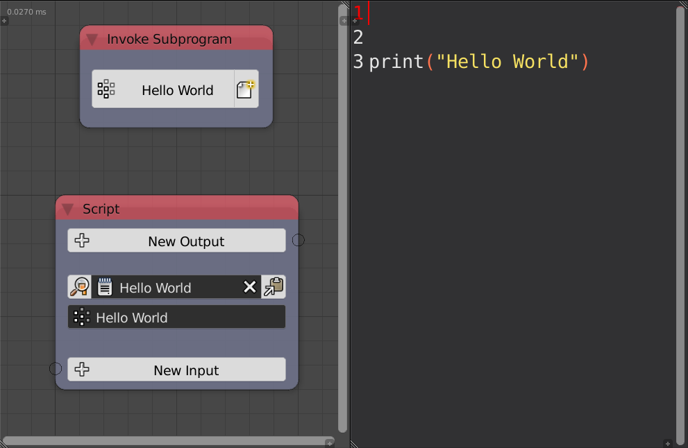
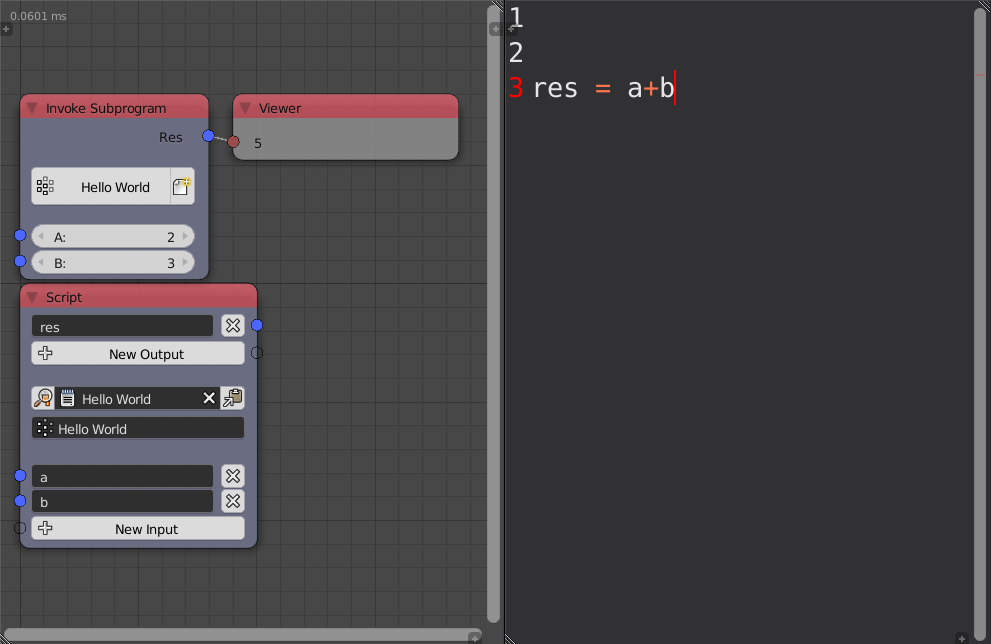
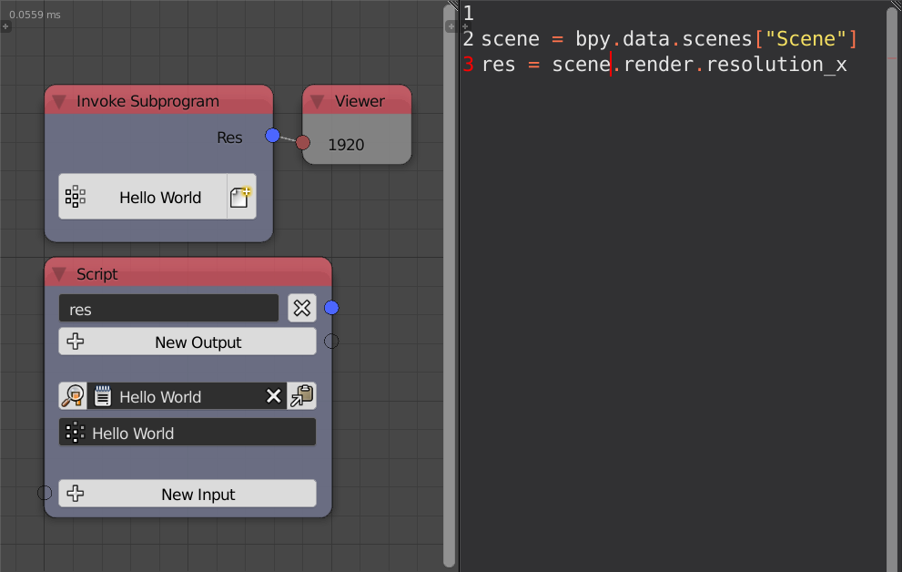

The script subprogram allows the execution of python scripts. Those
scripts are to be written in a blender text block. The scripts written
for the script node are slightly different from normal scripts in the
following:

- Inputs added to the node will be initialized as variables. So if one
    adds an input named `count` to the node, one can use the variable
    `count` in the script like any other variable. See below.

- Star imports are not allowed due to performance reasons. So
    something like `from random import *` will not work.

- Some python modules and structures are automatically imported so
    they needn't be imported when writing the scripts. Those modules
    include:
    
  - `bpy`.
  - `sys`.
  - `itertools`.
  - `animation_nodes`, or `AN` for short.
  - `algorithms`, which is short for `AN.algorithms`.
  - Mathutils structures: `Vector`, `Matrix`, `Quaternion`,
      `Euler`.
  - All data structures in `AN.data_structures`: `Vector3DList`,
      `Matrix4x4List`, `MeshData`, ...

New inputs can be added by using the *New Input* button. The name of the
input will be the name of the variable that is initialized with its
value, subsequently, the name of the input has to be unique and follow
the same guidelines for naming python variables, that is, starts with a
letter or and underscore, must not have white spaces and must not be a
python keyword.

New outputs can be added by using the *New Output* button. The value of
the output will be the value of the variable carrying its name at the
end of the script, subsequently, the same rules of naming variables
apply, it should be noted that the name should be unique of both the
inputs and outputs. For instance, if an integer output is added with the
name `result` and the script contains the line `result = 5 + 2` then the
value of the output is 7.

It should be noted that if the script can be refactored into a single
line, it would be better to use the *Expression Node* directly. Also,
note that context sensitive operators can't be used directly as the
context is always the node editor unless your force change it which is
not recommended.

## Advanced Node Settings

- **Description** - A description for the function of the script. This
    description only appears in the **Invoke Subprogram** node when
    choosing the required subprogram, however, it is a good practice to
    write a description for each subprogram so that other users can
    understand its function.
- **Interactive Mode** - If enabled, Animation Nodes will
    automatically import changes you make in the text editor. If
    disabled, a button will appear *Import Changes* that enables you to
    import changes manually when needed.
- **Debug Mode** - If enabled, errors in the script will be drawn on
    the node. If disabled, errors becomes fatal and will stop node tree
    executions until it is resolved.
- **Initialize Missing Outputs** - If enabled and outputs are not
    initialized, that is, no variables with the same name exists in the
    script, the outputs will get initialized with their default values,
    avoiding non initialization errors.
- **Correct Output Types** - If enabled, Animation Nodes will try to
    correct the type of outputs and return default value if it couldn't.
    For instance, if the an output is of integer type and it was
    initialized with a float, it will be converted to an integer by
    flooring.

## Examples

### Example 1

In this example, the script node just prints **Hello World**, it doesn't
have any inputs or outputs.

### Example 2

In this example, two inputs were given and an output is expected to be
initialized. The script initializes the output to the sum of inputs.

### Example 3

In this example, the node returns the x resolution of the scene. Notice
that we didn't have to import `bpy`, because it is already imported, see
above.
