## Custom Frequency Ranges

It is possible to bake a custom amount of frequency ranges in the *Sound
Bake* node. Previously there were 10 hardcoded ranges.

## Conditional Debug Nodes

The *Debug* and *Debug Drawer* node have a *Conditional* input now
(which is hidden by default). This allows more precise and easier
debugging in loops and other cases where a node is executed multiple
times with different inputs.



## Get Selected Objects Node

This node can easily be used together with the new conditional debug
nodes. It's important to know that this node will only work while during
creation of the node tree. When you start the render it is disabled,
because your render should not depend on the selection.

## Basic Shape Key Implementation

The two new socket types *Shape Key* and *Shape Key List* are part of AN
now. Also the *Object Instancer* node handles objects with shape keys
much better in v1.5.

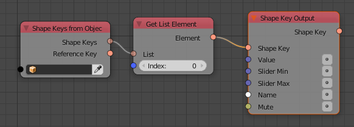

## Basic Font Implementation

There are two new socket types for fonts (*Font* and *Font List*).
Furthermore you have the ability to set the font of a text object using
the *Text Object Output* node now.

## Extended Math Nodes

New *Snap* and *Absolute* operation that can be used in the *Vector,
Euler and Quaternion Math* node. This enables you to snap values to
specific increments.

Note: *Snap* operation is also added to *Float Math* node, while
removing the *Round* operation from the list. (To round, you can use
*Snap* by setting Step Size to 1, 0.1, 0.01 etc. Or use the independent
*Round* node)

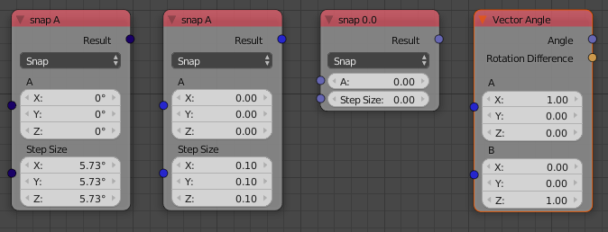

## Quaternion Math Node

Previously you were not really able to work with quaternions in a more
complex way.

## Parse Number Node

This node can convert a text into a number which is handy when you want
to parse a text block or something similiar that contains numbers.

## Extended Rotation Matrix Node

The *Rotation Matrix* node allows to create a rotation matrix for all 3
axis at once now (previously you had to create three individual matrices
and combine them or misuse the *Compose Matrix* node which is slower).

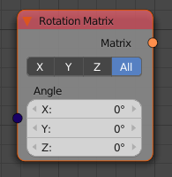

## Shear Matrix Node

The *Shear Matrix* node calculates a matrix that can be used to shear
meshes. You can't use this matrix on objects because it cannot be
decomposed into location, rotation and scale. Instead it can be used
with the *Transform Vector List* node.

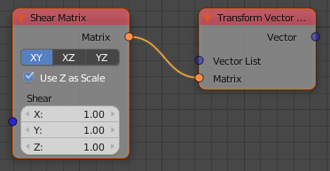

## Rotation to Direction Node

This is the reverse of the *Direction to Rotation*.

## BVH Tree

Next to the KD-Tree which can be used to find close points, you have
access to Blenders BVH-Tree module now. A BVH Tree is a data structure
that allows quick ray cast operations on many polygons. Make sure to use
Blender 2.77 when you use these nodes because there is a bug in the
previous version. The *Raycast* and *Find Nearest Surface Point* nodes
have additional *Min/Max Distance* inputs and a *Polygon Index* socket
output which you can unhide in the node panel in the right.

## Sequence Info Node

Access many different properties of a given sequence (the image doesn't
show all).

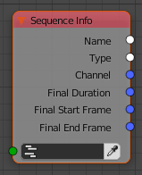

## Access Hair Data

The *Particle Info* node gives you access to some more particle
properties like hair points now (the image only shows a subset of the
possible outputs).

## Get Random List Elements Node

The same node can be archieved with a combination of some existing
nodes, but having a specialised node for that makes everything easier.

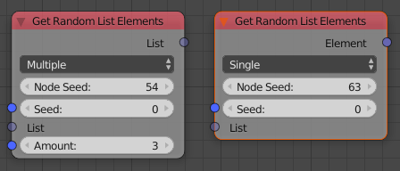

## Dynamic Node Labels

Dynamic node labels allows you to have cleaner node trees because some
nodes can show useful information in their label, which allows you to
collapse them without disadvantages.

## Shift List Node

## Data Interface Node

This node allows other addons to exchange data with AN. More information
is available here:
<http://animation-nodes-manual.readthedocs.org/en/latest/dev_guide/data_interface.html>

## ID Key System

The *ID Key* system got a major overhaul again. It is much more stable
now, which means it doesn't accidently remove some sockets. In general
the *ID Key System* allows you to store data for individual objects in
custom properties. The best known usecase for that is to store initial
transformations of multiple objects so that you can still access them
when the objects were moved by AN.

## Improved Support for Multiple Scenes

The *Object Instancer* takes *Scene List* as input instead of only one
scene now. This allows you to put the the instances into multiple scenes
without having to make multiple Instancers.

Each node tree has a *global Scene* that is used in all *Scene* and
*Scene List* sockets by default. The global scene can by changed in the
*Animation Node Tree* panel. It is never *None*.

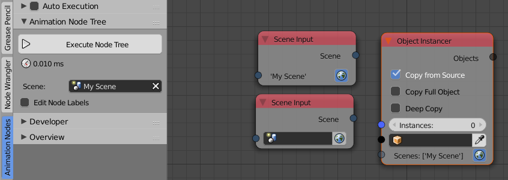

## List Operations

There are two new nodes that deal with lists now. The *Set List Element*
and *Remove List Element* nodes.

The *Remove List Element* node has three modes:

- Remove only the first occurrence of an element (limited to certain
    types)
- Remove all occurrences of an element (limited to certain types)
- Remove the element at a specific index (works with all list types)

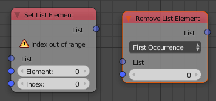

## Condition Socket for Reassign Parameter Node

This allows to model functions for eg finding the minimum and maximum
using a Loop. The *Condition* socket is hidden by default.

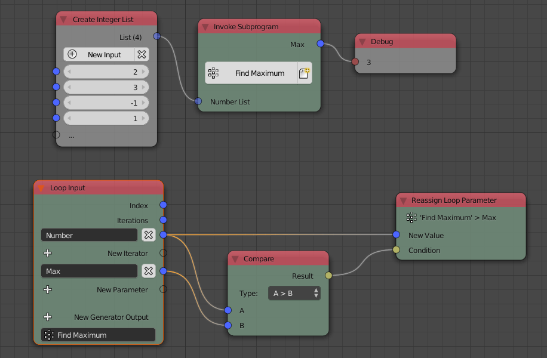

## Object Group Operations

This new node allows you to dynamically link and unlink objects from an
object group.

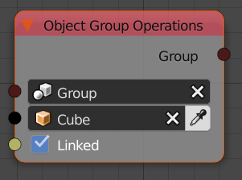

## List Math Nodes

The *Number List Math* node has a new operation now that can be used to
quickly calculate the average of multiple numbers.

The new *Vector List Math* supports adding multiple vectors together as
well as calculating the average.

## Overview and Statistics

The *Overview* panel allows you to turn *Auto Execution* on and off for
multiple node trees at once. Beside that you can jump to a specific tree
by clicking on its name now.

Clicking on the *Statistics* button opens the new *Statistics View* that
can give some interesting insights into how large your node tree is. The
two numbers in the *Nodes* column is the total node count as well as the
functional nodes (Reroute and Frame nodes are excluded).

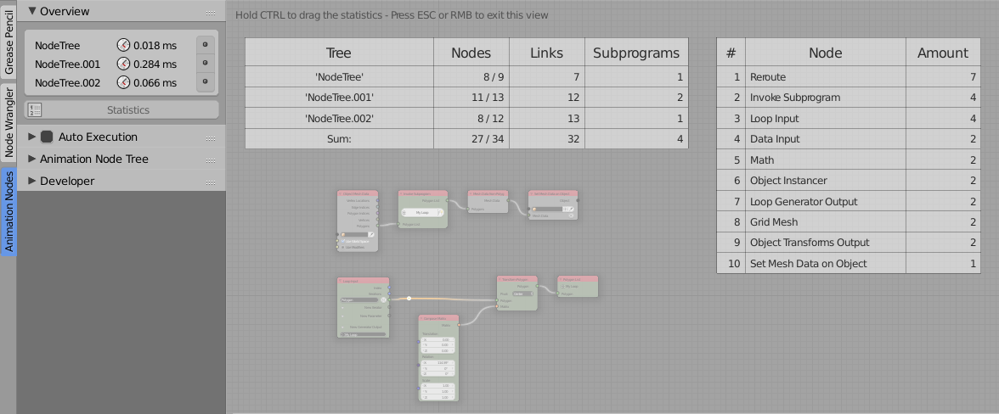

## Set Vertex Color Node

The *Set Vertex Color* node didn't change much in its appearance but it
is 15x faster now. What makes this node so special is that it is the
only non-hacky way to modify colors of individual objects that use the
same material. (A hacky way would be to missuse the pass\_index
property.) Also it has very little overhead when the same color is
already set. The ultimate solution to this problem is to get access to
Custom Properties of individual objects in Cycles materials.

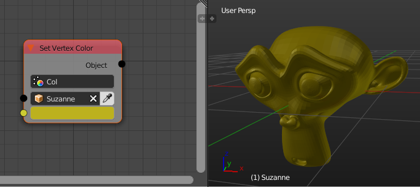

## Sort List Node

Sorting lists was only possible using Expression or Script nodes so far.
Using the new *Sort List* node this is not needed anymore. The node
automatically adapts to the list type that it is connected to. There are
two sort types that work with all list types:

- **Custom**: You'll get a little text box in which you can
  insert an expression  
  that will be used to get the sorting-key of the individual
  objects.

- **Key List**: In this mode you can provide the node with an
  extra list that  
  has the same length as the list you want to sort. The second
  list contains the sorting-keys for the individual objects.
  Most of the times you will need to make a simple loop with a
  generator output to create this key list. Supported key list
  types are *Float* and *String*.

Beside these two generic sorting modes, there are some simple sorting
templates for specific list types (currently only for object lists). We
can add more of these templates over time when needed. The node uses a
stable sorting algorithm.

Warning: Moving and sorting objects based on their position is not
always a good idea, because it leads to flickering..

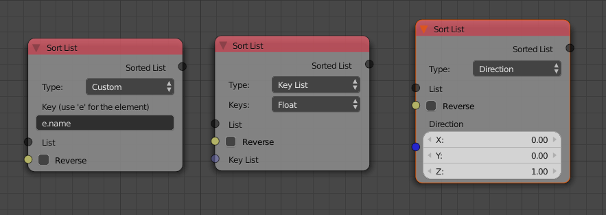

## Geometry Nodes

A small set of geometry nodes has been added to make certain operations
easier.

## Object Output Nodes

The object output nodes have been unified into more similiar nodes.

The *Set Splines on Object* node does not exist anymore. It is part of
the *Curve Object Output* node now.

Previously we had three nodes to replace the mesh of an object: *Set
Mesh Data on Object*, *Set BMesh on Object* and *Set Vertices on
Object*. These are all part of the *Mesh Object Output* node now.
Additionally we can set material indices of polygons with this new node.

## Change Text Case Node

## Smaller Changes

The *Get List Element* node has a *Clamp* checkbox now, that allows you
to clamp the index to the length of the list.

The *Create List* node displays the amount of elements in the output
list.

The *Object Mesh Data* node outputs the name of the mesh now (the socket
is hidden by default).

The *Random Text* node has a *Node Seed* property now.

The *Number*, *Vector*, *Euler* and *Quaternion Wiggle* nodes have a
*Speed* socket again and a better default speed than before.

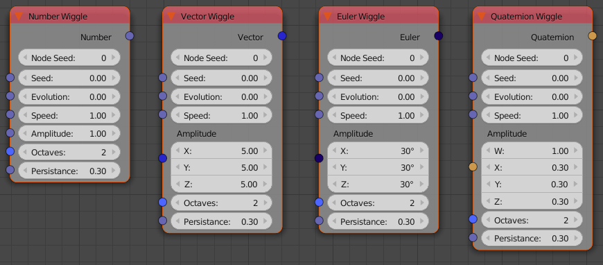

The *Auto Execution* panel changes when preview rendering is enabled
now. This is to make it more appearent that the *Always* option is
turned of in that case.

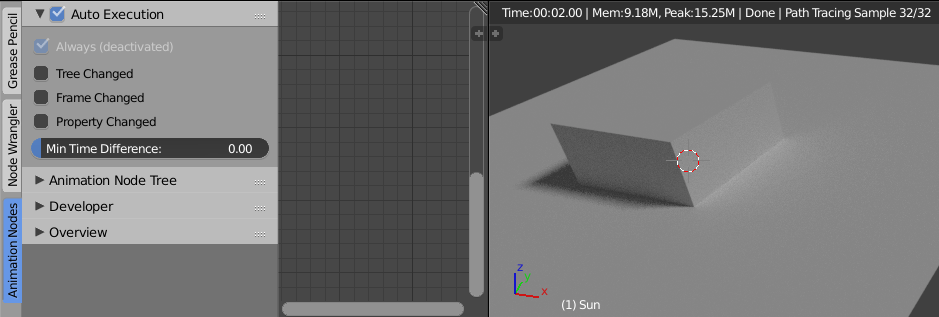

The *List* category got submenus for the *Create* and *Combine List*
nodes in order to force the user to make a type decision right at the
beginning. It is possible to change that type later, but it might not be
obvious. (The recommended way to insert specific *Create/Combine List*
nodes is to use the search.)

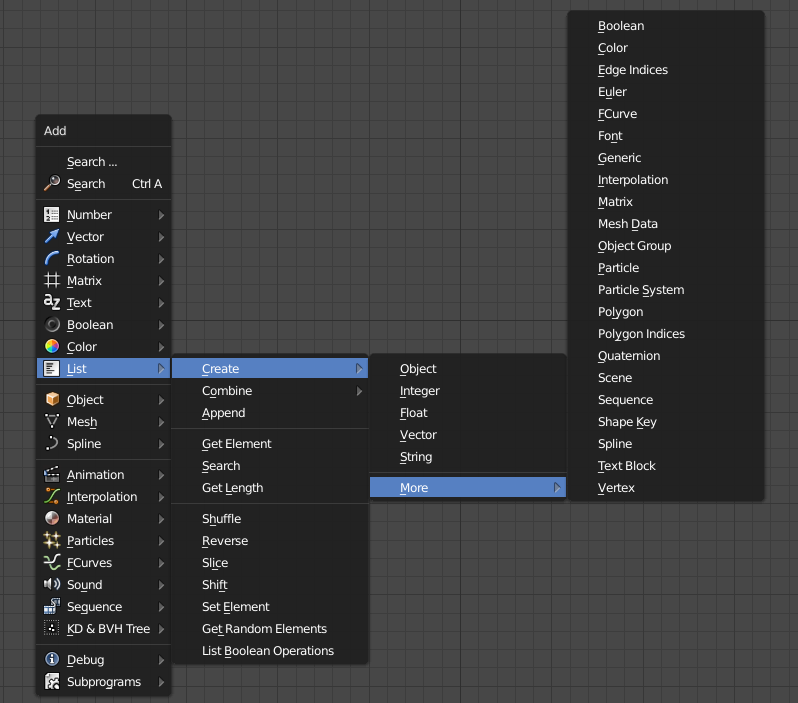

The *Transform Polygon* can be used with a custom pivot point now.

There is a *Boolean List* socket now.

When a user tries to connect a link to a *Script* node he now gets an
info popup that explains that he should use the *Invoke Subprogram* node
to execute the script.

AN uses a new better algorithm to sort the nodes before the execution
now. This results in a small speedup when working with many nodes and
large networks.

The *Object Instancer* node supports creation of empty objects now.

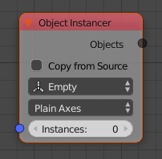

The *Frame* and *Reroute* nodes are now in the menu like in the other
node systems.

The *Direction to Rotation* node also outputs a rotation matrix and a
quaternion now.
