## Execution Triggers

Until now *Auto Execution* of node trees was limited to certain
predefined events like *Always*, *Frame Changed*, etc. Most people don't
like to have *Always* enabled all the time because slows down the scene
and heats up the cpu. This is a problem because sometimes the result of
the node tree only depends on the location of an object. So it would
make sense to only execute the tree when the location changes. This is
exactly what these new *Execution Triggers* allow you to do.

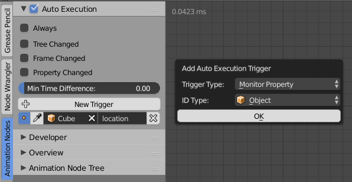

You just need to create the trigger, select an object and write/paste
the data path to the property. For convenience some nodes have a button
in the advanced settings that quickly creates the *Trigger* for this
specific node.

## Network Navigation

The functionality of the TAB key has been improved. It has context
sensitive behaviour now. Before this release it was only possible to
jump from an *Invoke Subprogram* node to the corresponding subprogram.
Now function depends more on the active node. Just try it out. It should
become pretty clear what happens when certain nodes are selected. More
information can be found in this [GitHub
Issue](https://github.com/JacquesLucke/animation_nodes/issues/480).

## Select Area

I always found it annoying to use Blenders text editor together with AN,
mainly because it required so many click to setup it up. For this
release I developed a new operator that makes it much faster to setup
the text editor. The operator itself is very generic, it allows you to
create/select an area in the Blender interface, the caller than decides
what to do with this area. It is already used in multiple places:
*Script* node, *Text Block* socket, *Debug Loop* and in the *Developer
Panel*.



## Popup to Rename Objects

The button to assign the active object to an object or spline socket got
a new functionality. When you hold down Ctrl and click it you get a
little popup that allows you to rename the object in place. This is very
handy when you want to clean up your scene but don't want to seach all
the objects in the outliner or the 3d viewport.



## Bake to Keyframes

Baking animations is often required before rendering. Sometimes because
AN is unstable during rendering (often this can be fixed by locking the
UI during rendering\!) or AN just does not exist on the computer that
will render the animation (think about renderfarms).

You could already create keyframes before using the *Set Keyframes* node
but it can be easier than that. And it is now. The *Bake to Keyframes*
button can be found in the *Overview* panel. Basicly it works in three
steps:

1.  Change the execution code type (more info below) to *Bake*
2.  Visit each frame in the timeline once
3.  Change the execution code type to *Default*

If you want to exclude certain node trees from the baking progress you
can just disable *Auto Execution* for them.

This operator can bake everything that can be animated with keyframes.
That excludes spline, text and mesh animation\!

This nodes support baking so far: *Object Attribute Output*, *Object
Data Path Output*, *Object Matrix Output*, *Object Transforms Output*,
*Object Visibility Output*, *Curve Object Output* (limited), *Text
Object Output* (limited) and *Text Sequence Output* (limited).

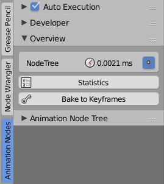

## Change Matrix Pivot Node

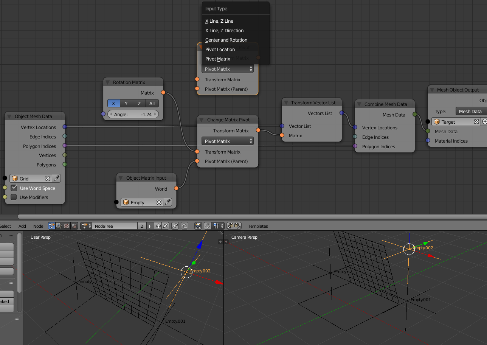

This node is mainly a companion or complement to the transform nodes. It
helps setting a custom "pivot point" for the transformation operations,
a process similar to parenting. Basically it replaces the need for some
matrix construction setups that can prove to be confusing sometimes and
not very "artist friendly"

Basic usage examples:

  - transform (rotation) of object goes around Empty
  - Rotation around axis, where X and Z are defined by points

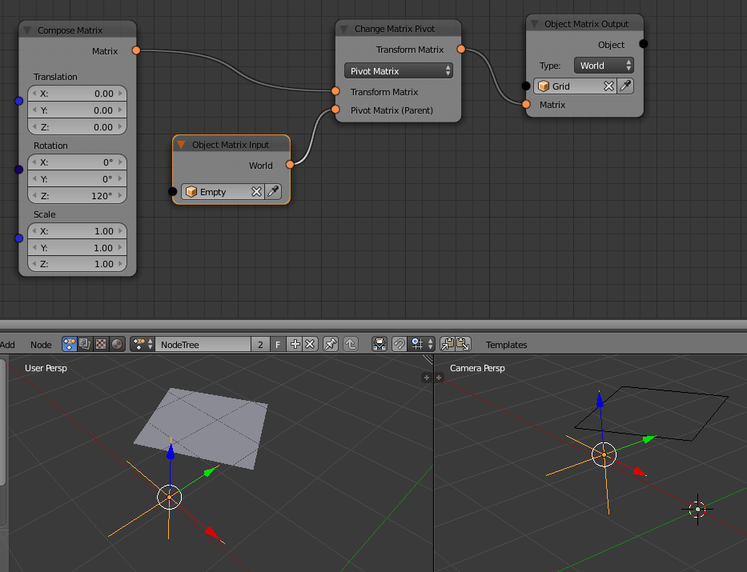

It does define the reference pivot in several ways, from simple location
to matrix or combinations of vectors and directions.

A classic and very used case, would be "flipping" a polygon around an
edge, where defining Z as normal and a side (0-1) as center and X
direction. (this can be defined otherwise with matrices etc. but can
prove quite complex setup)

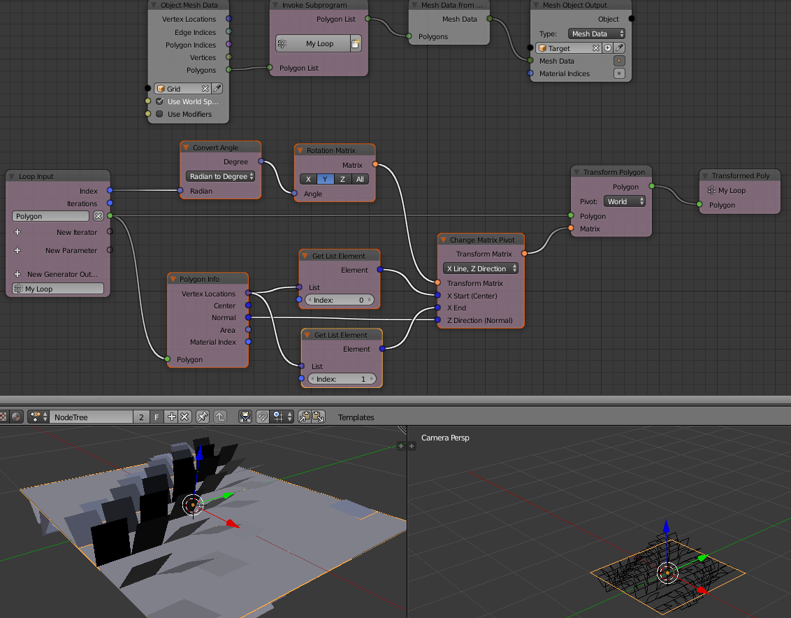

Note

When used along with a *Transform Polygon* node, the pivot type of that
node should be set to *World*.

## Structs

Structs are a new socket type. It can store multiple values in one
socket. Having such a type has multiple benefits:

  - It's easier to manage many records.
  - Can replace Generic Lists in some cases (generic lists are bad
    because they don't which data type they contain)
  - Allows us to have a new set of nodes in the future. E.g. for
    automatically reading and parsing .csv files.

It's also worth mentioning that struct nodes make sure that data types
stay correct.

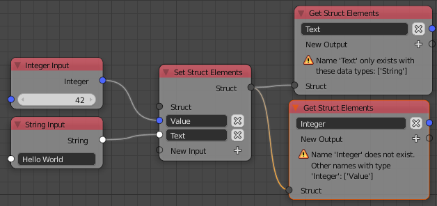

## BMesh Mesh Data

This is a node that exposes vertices, edges and faces as mesh data
(Vectors and Indices) or Animation Nodes Vertes and Polygon data, just
like the Object Mesh Data node, but from BMesh.

This comes handy when you need certain mesh data processed (like
recalculatng normals) and then use it further without the need to put it
into a "real" blender object. Also may find it useful for having Polygon
or Vertex data out of mesh data made by nodes.

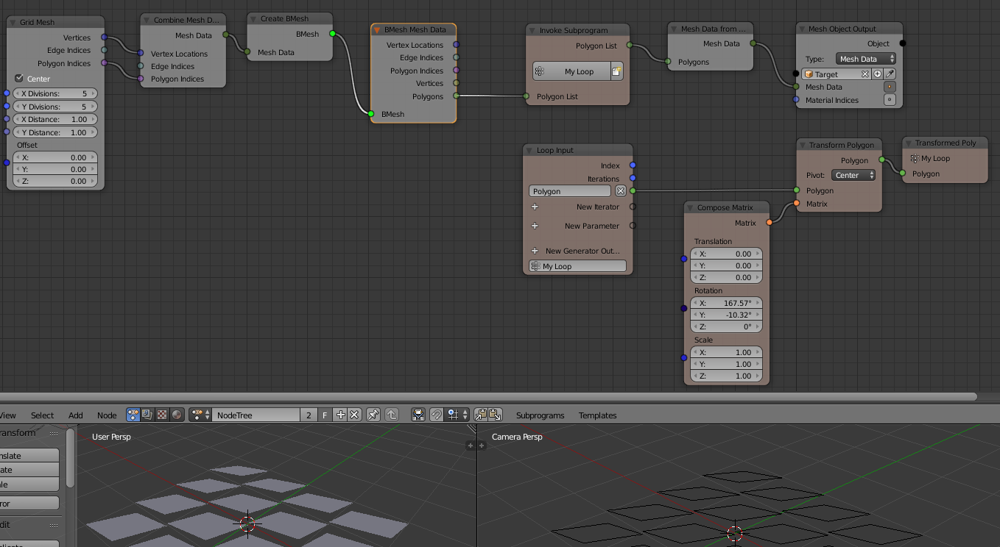

In the example, we use the transform polygon template, but to provide
polygons out of the grid mesh, this bmesh to mesh data is used.

## Geometry Nodes

There is a new set of tools (and menu) called *Geometry*. This contains
"helper" functions to process some data or establish relations between
elements, somehow more complex than vector math or matrix or rotation
functions.

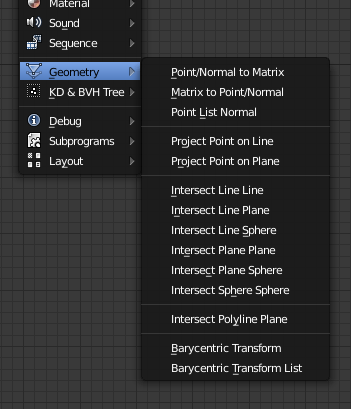

## Text File Reader

This node can read a text file from the hard drive without having to
open it in Blender. You can also specify an encoding. Most common are
*ascii* and *utf8* but there are much more. A full list can be found in
the [python documentation on
codecs](https://docs.python.org/3.5/library/codecs.html#standard-encodings).

The node caches the text internally and only reloads the text when the
file changed.

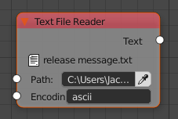

## Expression Node

The *Expression* node got two improvements in this release.

1.  When it is collapsed the expression will be in the node label now.

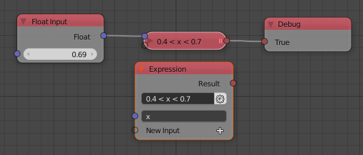

2.  Previously the expression node was almost always used together with
    a *Convert* node. This is not necessary anymore because the output
    socket of the expression node changes its type automatically now.
    Furthermore the data type of the expression result is checked and
    corrected if possible. This is to make sure that the node does not
    infiltrate the node tree with invalid data. The automatic type
    checking can be turned off in the advanced settings to remove
    overhead in extreme cases. The output data type can be changed
    manually by clicking on the little button next to the expression
    field.

## More Dynamic Labels

Dynamic labels are becoming more and more important in AN in order to
create cleaner looking node trees. They allow you to collapse nodes
without loosing any information on what they are doing. Here are some
examples:

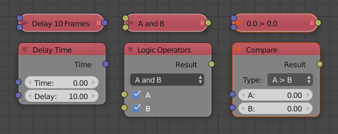

## Slice List

The slice list node has been extended to support all the different slice
that Python supports. The *Start*, *Stop* and *Step* sockets be enabled
and disabled as needed.

## Splines from Object Node

This node has two options now. You can either load all splines on a
curve object or only one with an index. Previously you would import all
splines first and pick one of them with the Get List Element node
afterwards. Unfortunally this adds unnecessary overhead because you
imported the other splines although you don't need them.

## Repeat and Fill List Nodes

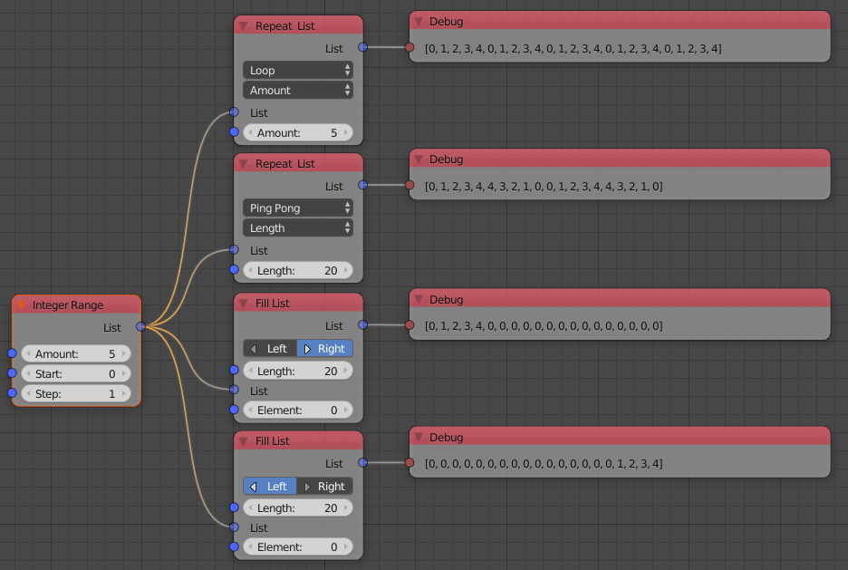

## Convert to Integer List Node

## Developer Tools

### Execution Code Types

AN can generate different execution codes based on the same node tree
now. This is used for some features which make the execution slower but
should have zero overhead when they are disabled. Currently there are
four different execution code types:

- Default:  
  This should be turned on most of the time. It just creates the
  execution code like before without any extra features enabled.

- Monitor Execution:  
  This creates a `try-except` block around the execution code of
  every node. Furthermore it checks if all the linked outputs
  have been calculated or if a node forgot something (this would
  raise an Exception in another node). This mode is helpfull
  when a node raises an exception but you cannot tell which one.
  It should only be turned on when there are problems.

- Measure Execution Times:  
  Measure the total and average time each node takes to execute
  and display the results in the node editor. I personally use
  this a lot when I try to improve the performance of certain
  nodes but it also helps to find the performance bottlenecks of
  whole node trees.

- Bake:  
  This is mainly used by the new bake function and should not be
  activated manually (although it is no problem to activate it).
  When it is enabled nodes like the *Object Transforms Output*
  node automatically create keyframes for the properties they
  change.

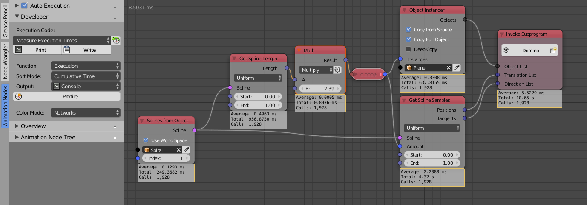

### Function Profiling

This feature is more important to people who develop AN, but it can also
be useful for others to find out which functions make your node tree
slow. Unfortunally it isn't very easy to understand the profiling output
if you don't know anything about programming.

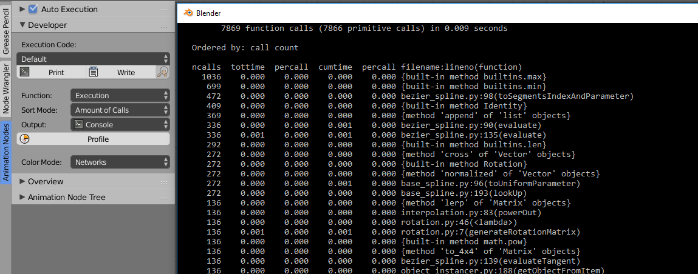

## Minor Changes

The execution time is now drawn into the top left corner of the node
editor to make it visible when the toolbar is closed.

The *Compose Matrix* node is roughly 40% faster now.

The *Splines from Object* node is 30% faster for bezier splines.

The *Interpolation from Curve Mapping* node does not remap the values
anymore. If you need an overshoot in the interpolation you can press the
minus-icon to zoom out.

The *Shade Object Smooth* node is twice as fast now.

This *Floating Advanced Panel* that you can open with the U key is fixed
now.

The width and location of the selected node in the Node Panel aren't
visible anymore when *Debug* is disabled in the user preferences of AN.

The *Change Text Case* node has two new modes: *Capitalize Words* and
*To Title Case*.

To make you aware of any problems in the node tree there will be a thin
red border around the node editor now (only when problems exist
obviously).

For ages there was a double update whenever a node has been created or
removed. This is now fixed. This is especially important for large node
trees when the code generation takes a noticeable amount of time.

AN always creates a python script based on your node tree. This script
needs to be recreated each time the node tree changes. In setups with
only a few nodes you never notice that because it is fast but as soon as
you have more than a few hundred nodes the time spend for the code
creation can become noticable. With this release the code generation
process is 2-3x faster for large node trees.

You can sort the generator outputs of a loop now. To do it you need to
select the corresponding Loop Input node and go into the advanced
settings.

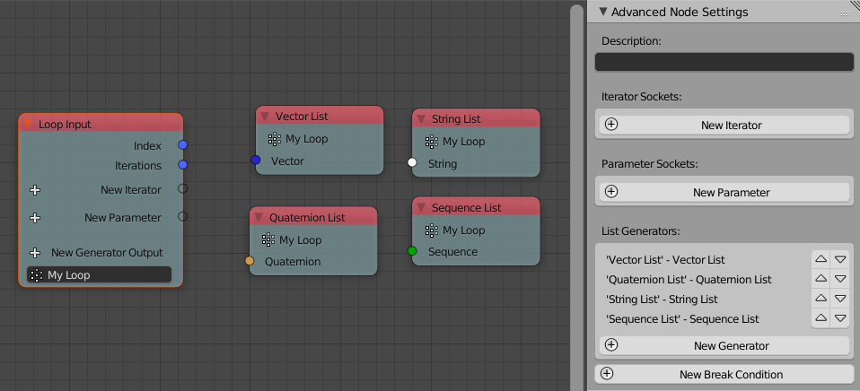

Help the user to remember to enable the socket when it is linked:

I moved the settings for the Debug Drawer node into the advanced
settings (in the right sidebar of the node editor, or press U while the
node is selected). The reason for that is that I rarely need to change
these settings and they took too much space.

## Broken Nodes

I'm not 100% if this is a full list but you'll definitly have to replace
these nodes when updating older files to this release:

  - Splines from Object
  - Object Matrix Output
