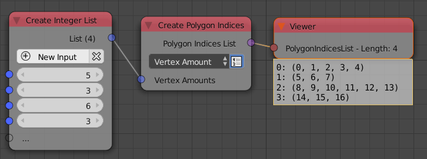

This category is one of the heavily updated one, a lot of nodes were
removed and a lot were added.

## Object Mesh Data

Vertex and Polygon data outputs were removed as well as their data
types, they are no longer available in AN 2.0. As an alternative, some
new outputs are available: Vertex Normals, Polygon Centers, Polygon
Normals, Local Polygon Areas and Material Indices. The new outputs are
pretty much what the polygon and vertex data included, so there no loss
of flexibility here, in fact it is much more efficient.



## Vertex Group Input

This newly added node return the weights of the selected vertex group.



## Cylinder Mesh

This newly added node creates the mesh data of a cylinder.



## Grid Mesh

Grid Mesh generator was redesigned and can now be defined either using
grid dimensions or step sizes for cells.



## Find Close Points

Find Close Points (previously named Find Close Vertices) node has been
redesigned. There are now two modes: Amount and Distance. The node also
returns distances between points as an output.



## Edges To Planes

Edges To Planes node was removed and replaced by Edges To Tubes node.

## Edges To Tube

This node was newly created as a replacement to the Edges To Planes node
and it simply create tubes in places of edges.



## Create Edges

This node was newly created and it returns edges info for edges that
connects each two vectors in the two input vector lists. The first
vectors in both lists are connected together, the second vectors in both
list are connected together and so on.



## Create Polygon Indices

A new option was added to create indices of the pattern `0,1,2,3, ...
,n` where n+1 is an input integer. This is helpful if vertices are in
the right order. The node also support the creation of multiple indices
list with different number of indices by checking the **Use List**
button next to the type menu.



## Edge Info

This node was newly added and it return some information about the input
edge data like their centers, length, starting and ending points.



## Create Bmesh

This node was newly added and it create a bmesh data type from a mesh
data type.



## Mesh Data From Object

This node was newly added and it returns the mesh data of the input
object. See example above.

## Replicate Mesh Data

This node was newly added and it instances the mesh data and transforms
it based on the input transformation matrices (or vectors).





## Extract Polygon Transforms

This node was newly added and it returns transformation matrices that
describe the location and orientation of the input polygons. The local x
axis is aligned with the direction of the first edge of each polygon.



## Prepare Polygon Transformation

This node was newly added. It separates the input polygons and return
them in their unity position, that is, they are located at the center of
the world and lie on the xy plane. It also return a list of
transformation matrices that if used to transformed the output polygons,
the result will be the polygons in their initial position and
orientation. This node is useful when used with transform polygons.



## Transform Polygons

This node was newly added and it transforms input polygons based on an
input transformation matrix. Note that the individual polygons should be
separated from each others for this operation to make sense.



## Separate Polygons

This node was newly added and it simply separate the input polygons, the
result is exactly the same if you used the Prepare Polygon
Transformation node and transformed the polygons based on the
transformation matrices given.



## Mesh Object Output

Advanced settings have been changed and extended. Now, with the new
**Ensure Animation Data** feature (enabled by default), it allows
exporters (mainly Alembic) to export the mesh correctly.

## Get Bounding Box

Get bounding box node now returns the mesh data of the bounding box as
well as its center.



## Polygon Info

Polygon Info node was removed.

## Vertex Info

Vertex Info node was removed.
